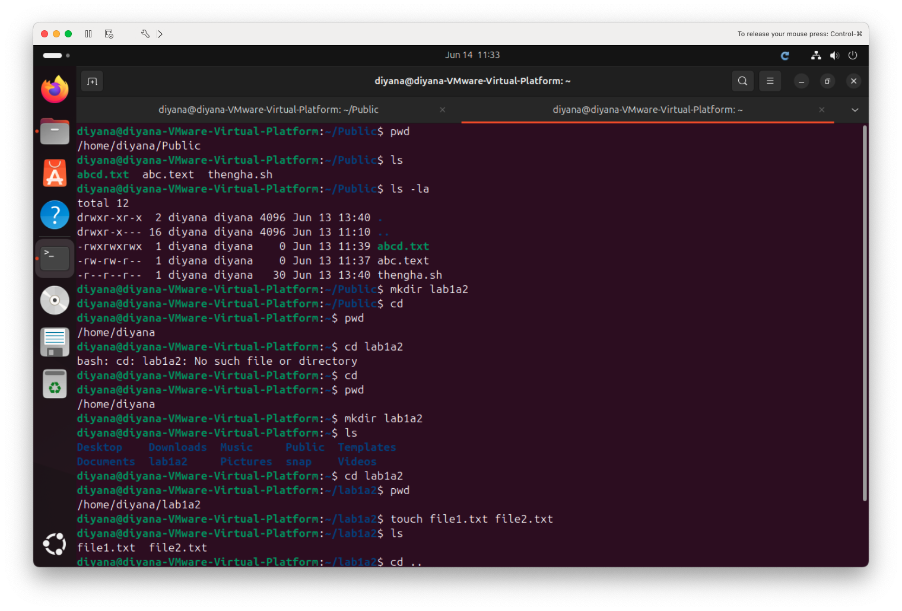
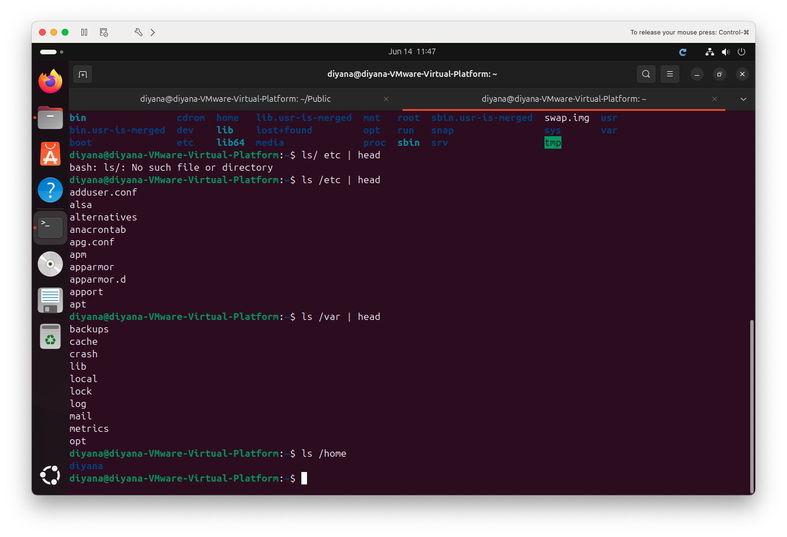
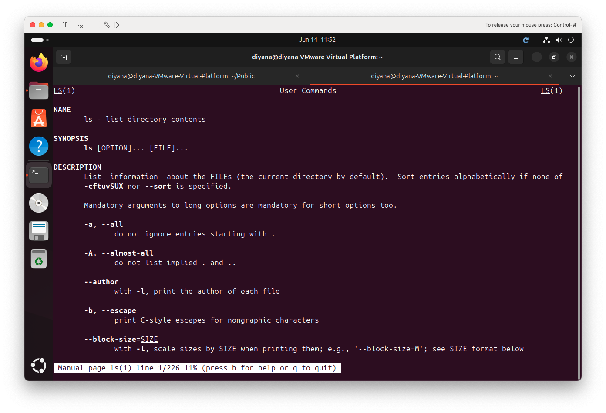
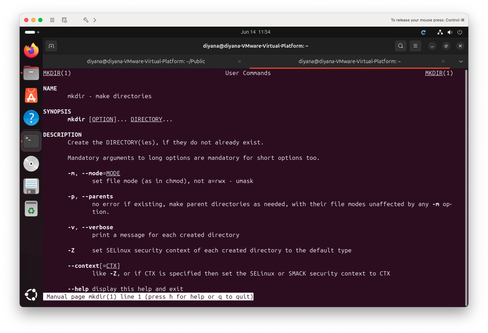
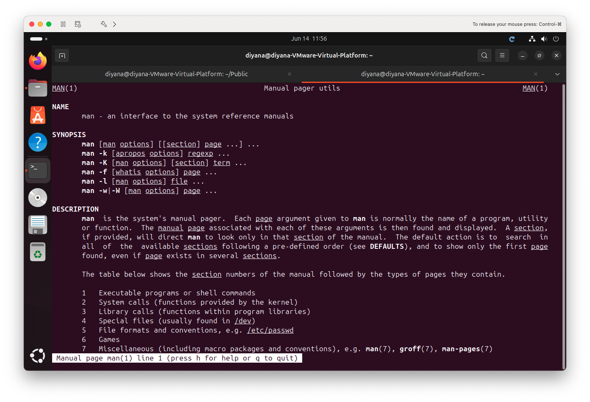

\# 1a-2 Familiarity with Ubuntu Linux — Basic Command Line Navigation

**Unit:** Introduction to Server Environments and Architectures
**Environment:** Ubuntu 24.04 LTS running on VMware Fusion (macOS host)

This lab covers basic command-line navigation, understanding the Linux
directory structure, and using the built-in manual (`man`) pages.

---

## 1. Basic Navigation — `pwd`, `ls`, `cd`, `mkdir`, `touch`

These commands are used to move around the filesystem and create files and
folders.

| Command | Purpose |
|---------|---------|
| `pwd` | Print Working Directory — shows where you currently are |
| `ls` | List the files in the current directory |
| `ls -la` | List **all** files (including hidden) in **long** format |
| `mkdir` | Make a new directory (folder) |
| `cd` | Change directory (move into a folder) |
| `cd ..` | Move up one level to the parent directory |
| `touch` | Create a new empty file |

**Commands run:**

```bash
cd ~                       # go to home directory
pwd                        # confirm location: /home/diyana
mkdir lab1a2               # create a new folder
ls                         # confirm folder was created
cd lab1a2                  # move into the new folder
pwd                        # confirm new location
touch file1.txt file2.txt  # create two empty files
ls                         # list the new files
cd ..                      # move back up one level
```

**Evidence:**



> **Note on relative paths:** `cd foldername` only works if that folder exists
> in the directory you are currently in. Typing `cd` on its own always returns
> you to your home directory. This was learned first-hand when a folder created
> inside `~/Public` could not be reached from `~` until the correct path was used.

---

## 2. Linux Directory Structure — `/etc`, `/var`, `/home`

The Linux filesystem starts at the root (`/`) and branches into standard
system directories.

**Command run:**

```bash
ls /              # list the root of the filesystem
ls /etc | head    # configuration files
ls /var | head    # variable data (logs, caches)
ls /home          # user home directories
```

**Key directories explained:**

| Directory | Contains |
|-----------|----------|
| `/etc` | System and application **configuration files** |
| `/var` | **Variable data** — logs (`/var/log`), caches, spool files |
| `/home` | **User home directories** — each user's personal files |
| `/bin`, `/usr` | System programs and binaries |
| `/boot` | Files needed to boot the system |

**Evidence:**



> **Note on spacing:** In Linux, a space separates the command from its target.
> `ls /etc` means "run `ls` on `/etc`". Writing it as `ls/ etc` causes an error,
> because the shell reads `ls/` as a command that does not exist.

---

## 3. Manual Pages — `man`

The `man` (manual) command displays built-in documentation for any command,
including its purpose, syntax, and all available options. This is the standard
way to learn a command without needing the internet.

**Commands run:**

```bash
man ls       # manual for the ls command
man mkdir    # manual for the mkdir command
man man      # manual for the manual system itself
```

To navigate a man page: scroll with the **arrow keys**, and press **`q`** to
quit back to the terminal.

**Evidence:**







---

## Reflection

Working through the command line gave me a clearer understanding of how Linux
is organised compared to a graphical interface. Navigation commands like `pwd`,
`cd`, and `ls` make it easy to see exactly where I am and what is around me,
and creating files and folders with `mkdir` and `touch` felt faster than using
a file manager once the commands were familiar.

The most useful lesson was understanding **relative paths** — a folder created
in one directory cannot be reached from another unless the correct path is used.
I learned this directly by making the mistake and then correcting it.

Exploring the directory structure (`/etc`, `/var`, `/home`) showed how Linux
keeps configuration, logs, and user data in clearly separated locations, which
makes the system easier to manage and secure. Finally, the `man` command stood
out as a powerful tool: it means almost any command can be understood directly
from the terminal, without searching online.