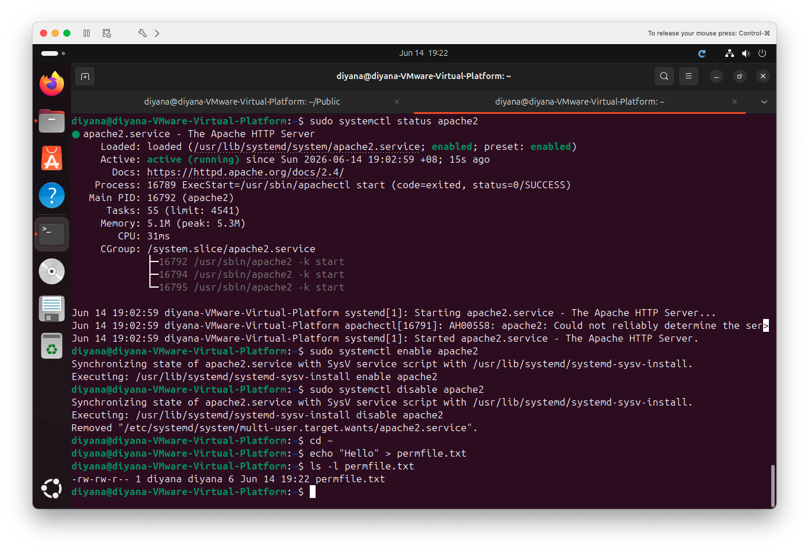
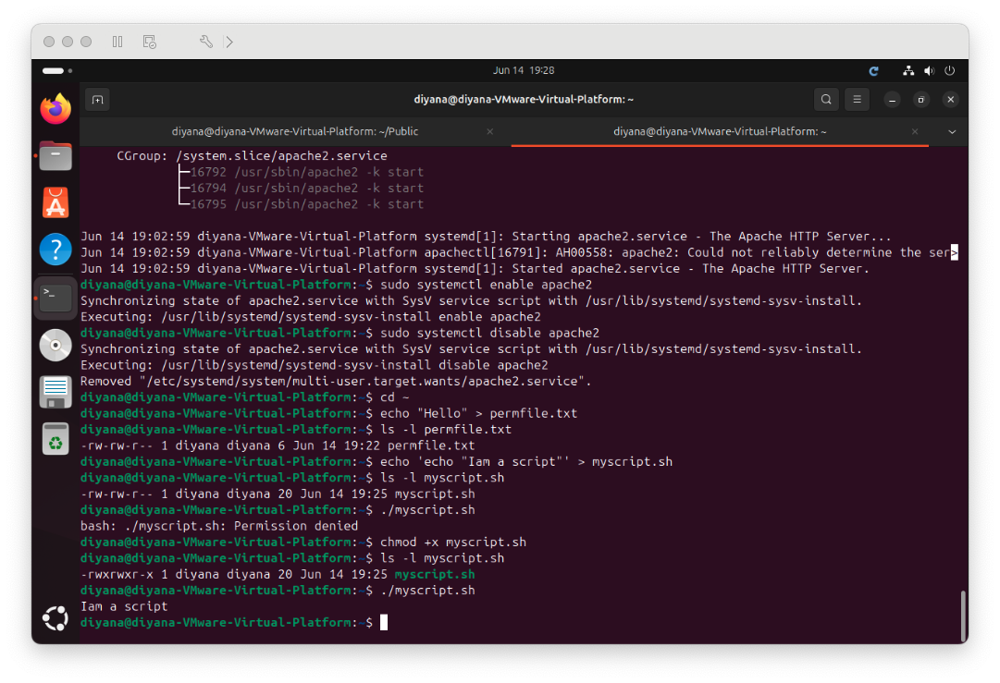
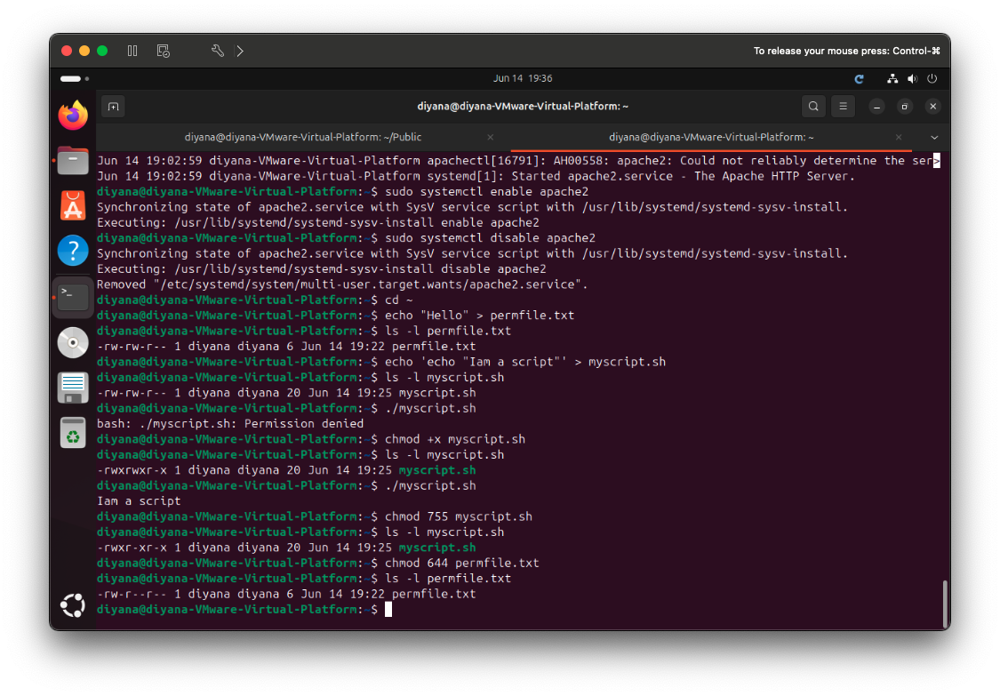
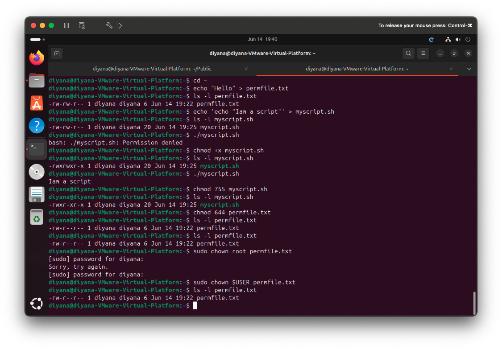

# 1b-2 Linux Permissions — File Permissions & Ownership

**Unit:** Introduction to Server Environments and Architectures
**Environment:** Ubuntu 24.04 LTS running on VMware Fusion (macOS host)

This lab covers how to view and change **file permissions** with `chmod`, and
how to change **file ownership** with `chown`. Permissions control who can read,
write, or execute a file.

---

## Understanding Permissions

Running `ls -l` shows a permission string such as `-rwxr-xr-x`. It is read in
four parts:

```
-     rwx        r-x        r-x
type  owner      group      others
```

- **type** — `-` for a file, `d` for a directory
- **owner / group / others** — three sets of permissions
- **r** = read (4), **w** = write (2), **x** = execute (1)

**Numeric (octal) values** add the permissions in each set:

| Number | Permissions | Meaning |
|--------|-------------|---------|
| 7 | rwx | read + write + execute |
| 6 | rw- | read + write |
| 5 | r-x | read + execute |
| 4 | r-- | read only |

So `chmod 755` = owner `rwx`, group `r-x`, others `r-x`.

| Command | Purpose |
|---------|---------|
| `ls -l` | View permissions and ownership |
| `chmod +x file` | Add execute permission (symbolic) |
| `chmod 755 file` | Set permissions using numeric values |
| `chown user file` | Change the owner of a file |

---

## Stage 1 — View Permissions with `ls -l`

```bash
echo "hello" > permfile.txt
ls -l permfile.txt
```

The output shows the permission string, owner, and group for the file.



---

## Stage 2 — Add Execute Permission with `chmod +x`

A script file has no execute permission by default, so it cannot be run until
permission is added.

```bash
echo 'echo "I am a script!"' > myscript.sh
ls -l myscript.sh        # no 'x' present
./myscript.sh            # fails: Permission denied
chmod +x myscript.sh     # add execute permission
ls -l myscript.sh        # 'x' now appears
./myscript.sh            # the script now runs
```

This shows the "Permission denied" error first, then success after adding `x`.



---

## Stage 3 — Numeric Permissions (`chmod 755` / `644`)

```bash
chmod 755 myscript.sh
ls -l myscript.sh        # -rwxr-xr-x
chmod 644 permfile.txt
ls -l permfile.txt       # -rw-r--r--
```

- **755** — owner can do everything; group and others can read and execute
  (common for scripts and programs).
- **644** — owner can read and write; everyone else can only read
  (common for normal files).



---

## Stage 4 — Change Ownership with `chown`

```bash
ls -l permfile.txt            # current owner: diyana
sudo chown root permfile.txt  # change owner to root
ls -l permfile.txt            # owner is now root
sudo chown $USER permfile.txt # change ownership back
ls -l permfile.txt            # owner back to diyana
```

`chown` requires `sudo` because changing ownership is an administrative action.



---

## Reflection

This lab made it clear why Linux is considered a secure multi-user system.
Every file has an owner, a group, and a separate set of permissions for
"others", which controls exactly who can read, modify, or run it.

The most useful moment was watching a script fail with "Permission denied" and
then run successfully after `chmod +x` — it showed directly that the **execute**
permission is what allows a file to run, not just its `.sh` name. Learning the
numeric system (`r=4, w=2, x=1`) also made values like `755` and `644` easy to
read instead of memorise.

Understanding `chmod` and `chown` is essential for server work, since incorrect
permissions are a common cause of scripts that will not run and services that
cannot read their files — while overly open permissions are a security risk.
