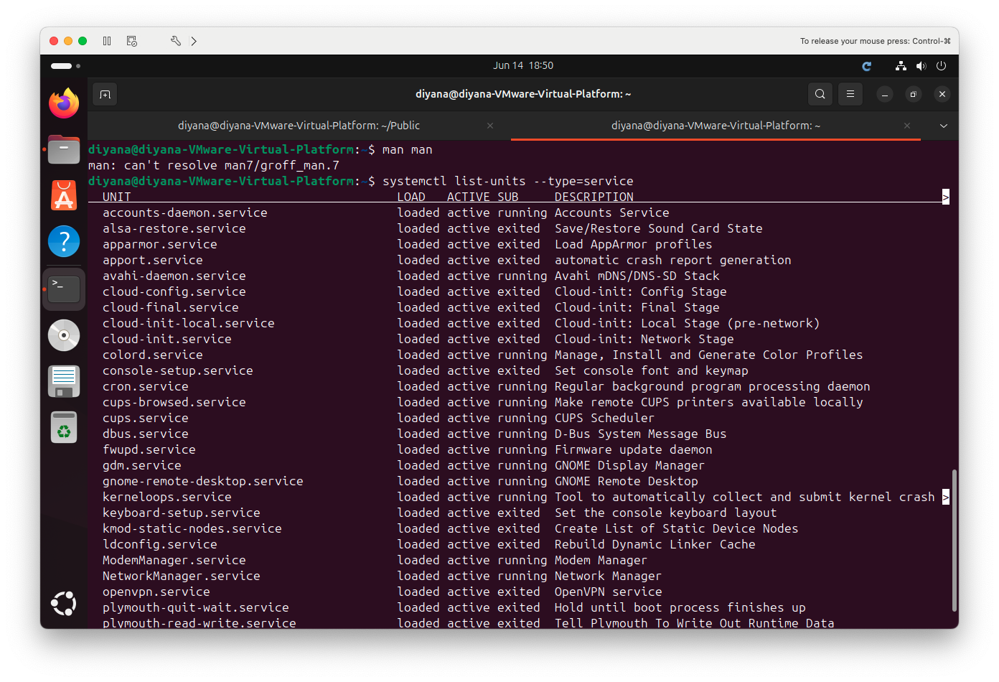
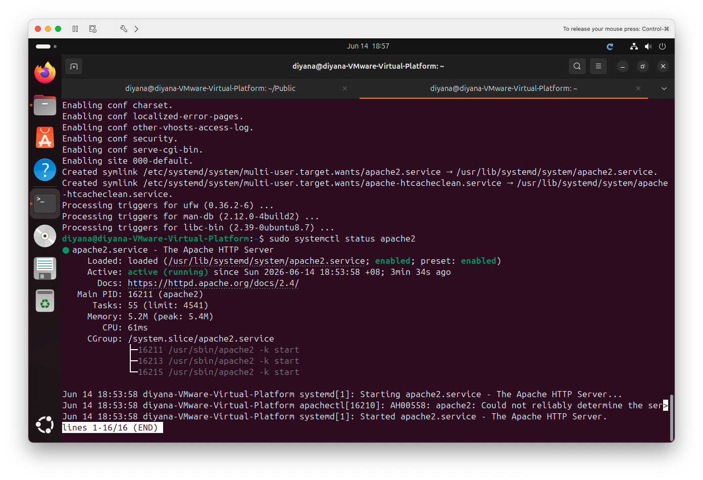
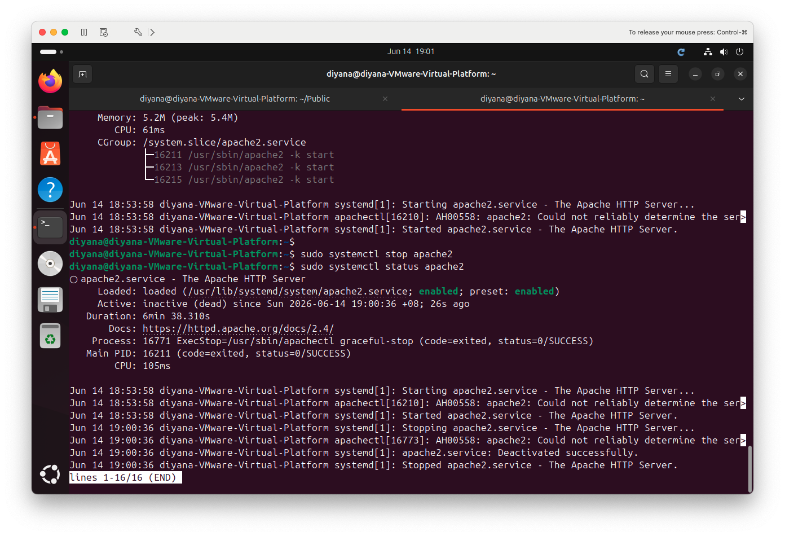
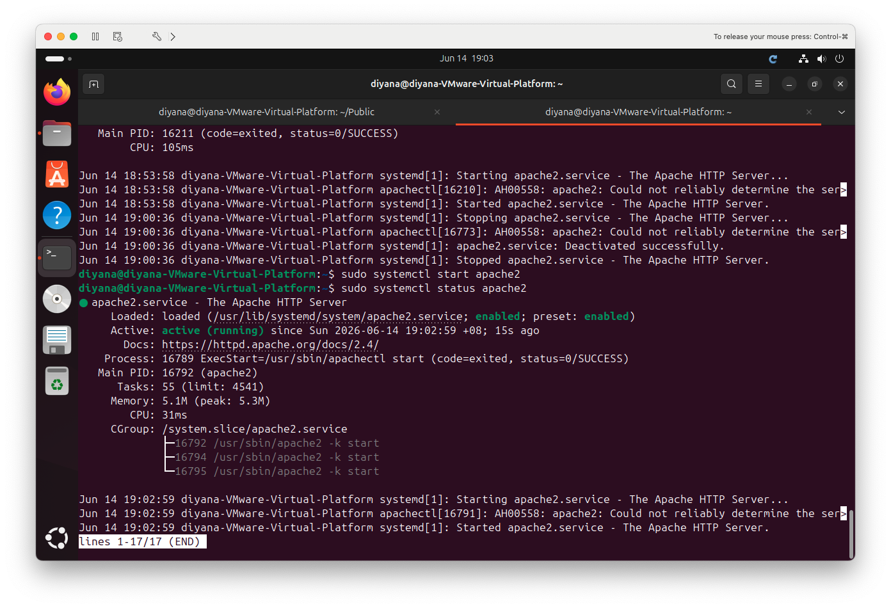
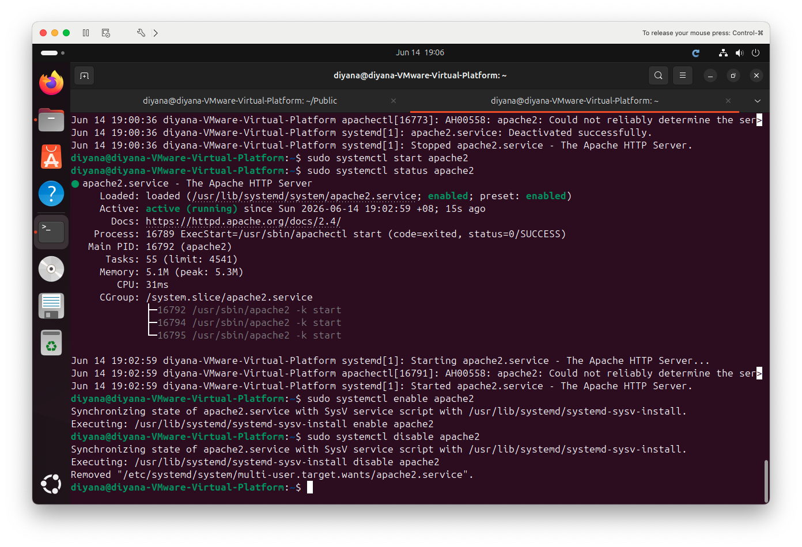

# 1b-1 Linux Services — Managing Background Services with `systemctl`

**Unit:** Introduction to Server Environments and Architectures
**Environment:** Ubuntu 24.04 LTS running on VMware Fusion (macOS host)

This lab covers how to view and control **services** (background programs, also
called *daemons*) using `systemctl`, the command that manages services through
**systemd** — Ubuntu's system and service manager.

---

## What is a Service?

A **service** is a program that runs in the background without a user interface,
providing functionality such as a web server, SSH access, or scheduled tasks.
On Ubuntu, services are managed by **systemd**, and the `systemctl` command is
used to start, stop, check, and configure them.

| Command | Purpose |
|---------|---------|
| `systemctl list-units --type=service` | List all loaded services |
| `systemctl status <service>` | Check whether a service is running |
| `systemctl start <service>` | Start a service now |
| `systemctl stop <service>` | Stop a service now |
| `systemctl restart <service>` | Restart a service |
| `systemctl enable <service>` | Start the service automatically at boot |
| `systemctl disable <service>` | Do not start the service at boot |

---

## Stage 1 — List All Services

```bash
systemctl list-units --type=service
```

This displays all currently loaded services and their state (`active`,
`running`, `exited`, etc.). Scroll with the arrow keys and press **`q`** to quit.



---

## Stage 2 — Install a Service to Practise On (Apache)

The Apache web server (`apache2`) is installed as a practice service.

```bash
sudo apt install apache2 -y
```

---

## Stage 3 — Check Service Status

```bash
sudo systemctl status apache2
```

The output shows **`active (running)`** in green, confirming the service is up.
Press **`q`** to exit the status view.



---

## Stage 4 — Stop the Service

```bash
sudo systemctl stop apache2
sudo systemctl status apache2
```

After stopping, the status changes to **`inactive (dead)`**.



---

## Stage 5 — Start the Service Again

```bash
sudo systemctl start apache2
sudo systemctl status apache2
```

The service returns to **`active (running)`**.



---

## Stage 6 — Enable / Disable at Boot

```bash
sudo systemctl enable apache2    # auto-start on system boot
sudo systemctl disable apache2   # do not auto-start on boot
```

`enable` creates a startup link so the service launches automatically when the
system boots; `disable` removes it.



---

## Reflection

This lab made the concept of a "service" concrete. Before, background programs
like web servers felt invisible, but `systemctl` showed exactly what is running
on the system and gave direct control over each service.

The key distinction I learned was between **controlling a service now**
(`start` / `stop` / `restart`) and **controlling whether it runs at boot**
(`enable` / `disable`) — two separate ideas that are easy to confuse. Watching
the Apache status switch between `active (running)` and `inactive (dead)` after
each command made the effect of every action clear.

Understanding `systemctl` is essential for server administration, since keeping
the right services running — and stopping unnecessary ones — is central to both
the performance and the security of a Linux server.
