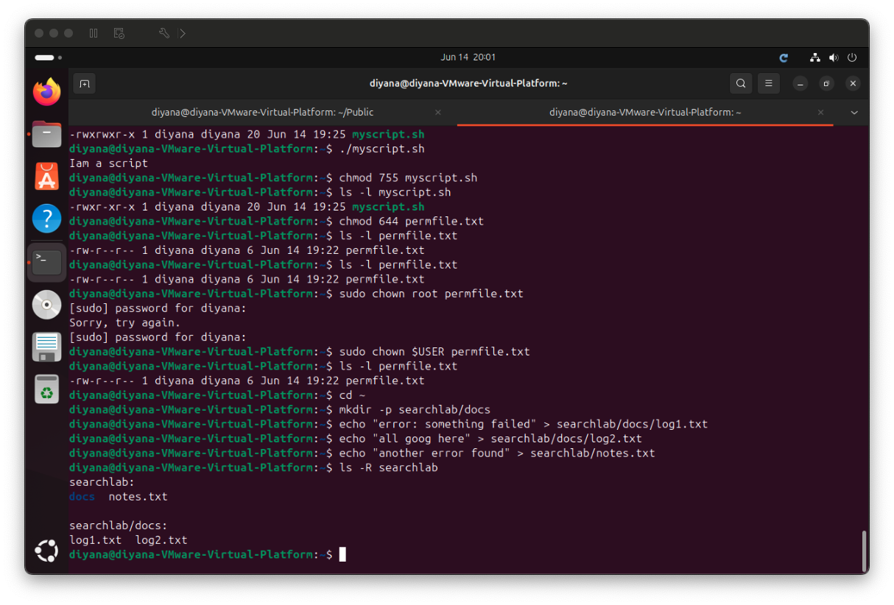
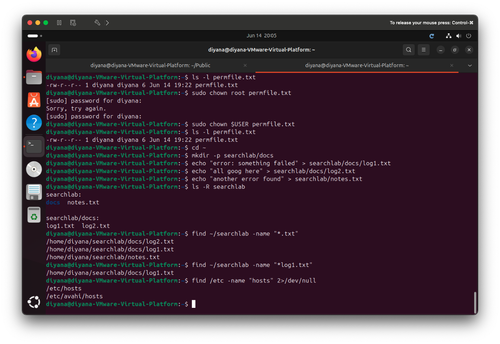
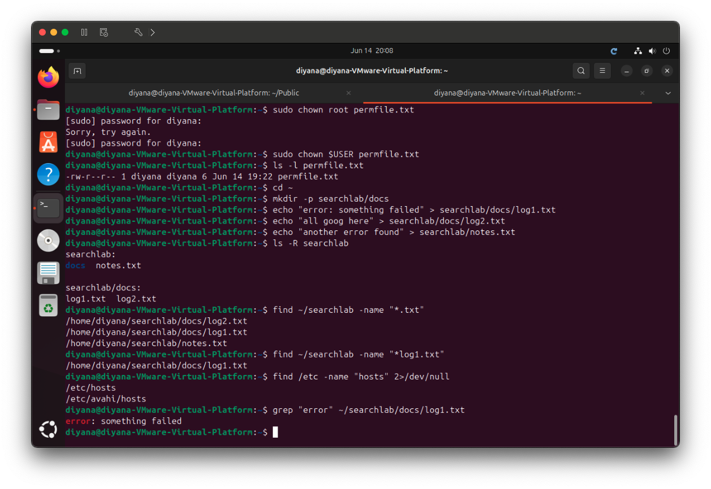
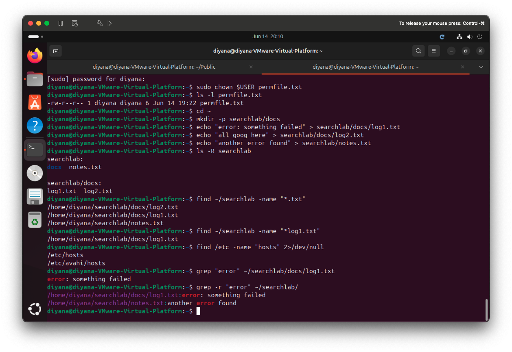

# 1b-3 Searching Filesystems — `find` and `grep`

**Unit:** Introduction to Server Environments and Architectures
**Environment:** Ubuntu 24.04 LTS running on VMware Fusion (macOS host)

This lab covers two essential search tools:
- **`find`** — locates **files** by name, type, or location
- **`grep`** — searches **inside files** for matching text

---

## Tool Summary

| Command | Purpose |
|---------|---------|
| `find <path> -name "<pattern>"` | Find files by name within a path |
| `find <path> -name "*.txt"` | Find all files matching a wildcard |
| `grep "<text>" <file>` | Search for text inside a single file |
| `grep -r "<text>" <path>/` | Search recursively through all files in a folder |

**Key difference:** `find` searches for **files themselves** (by name/location),
while `grep` searches for **content inside files**.

---

## Stage 1 — Set Up Test Files

A small folder of files is created so the searches return clear results.

```bash
cd ~
mkdir -p searchlab/docs
echo "error: something failed" > searchlab/docs/log1.txt
echo "all good here" > searchlab/docs/log2.txt
echo "another error found" > searchlab/notes.txt
ls -R searchlab
```



---

## Stage 2 — `find` (Locate Files by Name)

```bash
find ~/searchlab -name "*.txt"        # all .txt files in searchlab
find ~/searchlab -name "log1.txt"     # one specific file by name
find /etc -name "hosts" 2>/dev/null   # locate a system file in /etc
```

`find` walks through directories and returns the **full path** of any file
matching the pattern. The `2>/dev/null` hides permission-denied messages so the
output stays clean.



---

## Stage 3 — `grep` (Search Inside a File)

```bash
grep "error" ~/searchlab/docs/log1.txt
```

`grep` looks **inside** the file and prints every line that contains the search
term — here, the line containing "error".



---

## Stage 4 — `grep -r` (Recursive Search)

```bash
grep -r "error" ~/searchlab/
```

The `-r` (recursive) option searches **every file in every subfolder**. The
output lists each matching line **prefixed with the filename** it was found in,
so matches appear from both `log1.txt` and `notes.txt`.



---

## Reflection

This lab showed the difference between searching for files and searching within
them. `find` is the right tool when I know a file exists somewhere but not where
— it locates files by name across the whole directory tree. `grep` is the right
tool when I need to know **which files contain a particular piece of text**, such
as searching log files for the word "error".

The recursive `grep -r` option stood out as especially powerful for server work:
being able to scan an entire directory of logs or configuration files for a
keyword in one command is exactly what is needed when troubleshooting a server.

Together, `find` and `grep` make the command line far more efficient than
clicking through folders manually, and they are skills I expect to use
constantly when managing real Linux systems.
