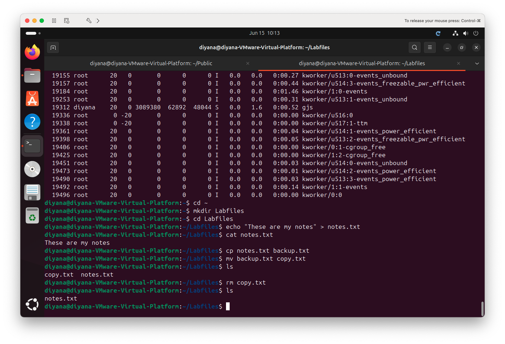
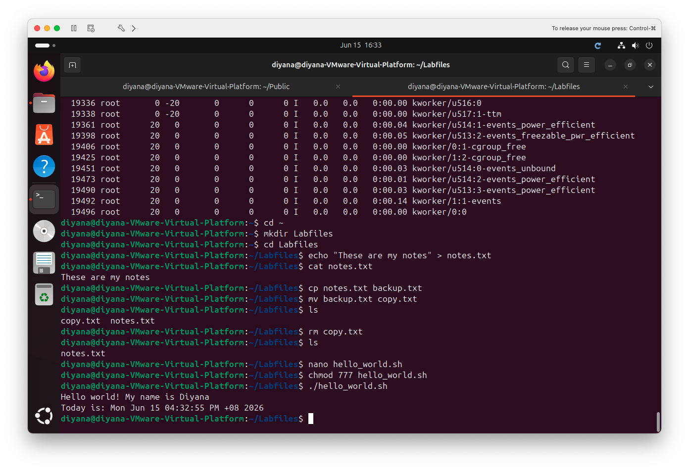
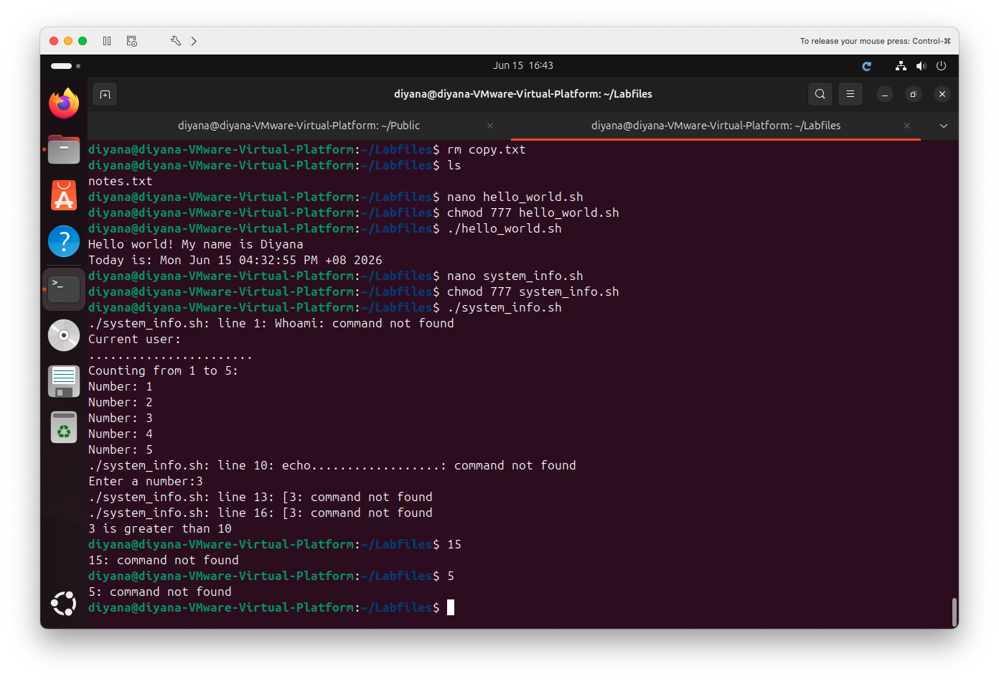
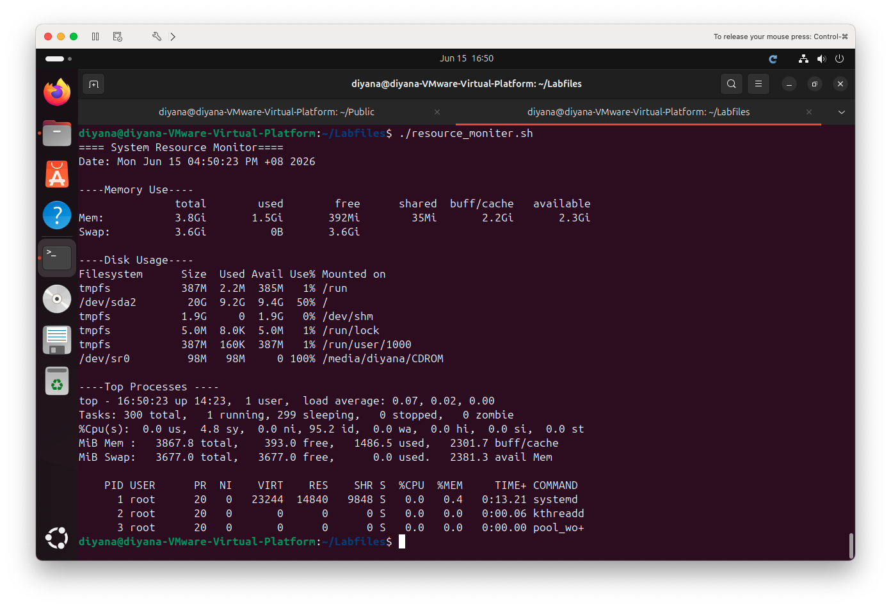

# 2b-2 Introduction to Bash Scripting & System Automation

**Unit:** Introduction to Server Environments and Architectures
**Environment:** Ubuntu 24.04 LTS running on VMware Fusion (macOS host)

This lab covers writing and running **Bash scripts** — automating tasks with
file operations, loops, conditionals, user input, and system monitoring.

---

## Part 1 — File System Operations

```bash
cd ~
mkdir LabFiles
cd LabFiles
echo "These are my notes" > notes.txt
cat notes.txt            # view content
cp notes.txt backup.txt  # copy the file
mv backup.txt copy.txt   # rename the copy
ls
rm copy.txt              # delete the file
ls
```



### Reflection — File System Commands (Deliverable 2)
- **Command to create a directory:** `mkdir`
- **View file content without a GUI editor:** `cat` (or `less`, `head`, `tail`)
- **Difference between `cp` and `mv`:** `cp` makes a **copy** (the original
  stays in place), while `mv` **moves or renames** a file (the original no
  longer exists in its old name/location).

---

## Part 2 — Basic Bash Script: `hello_world.sh`

```bash
#!/bin/bash
echo "Hello World! My name is Diyana"
echo "Today is: $(date)"
```

Run it:
```bash
chmod 777 hello_world.sh
./hello_world.sh
```



### Reflection — Script Basics (Deliverable 4)
- **What is `chmod +x` for?** It adds **execute** permission to a file so it can
  be run as a program. Without it, the script returns "Permission denied".
- **Why is `#!/bin/bash` used?** This is the **shebang** line. It tells the
  system which interpreter to use to run the script — here, the Bash shell.
- **How can you personalise script output?** By using `echo` with **variables**
  and **command substitution**, e.g. `$(whoami)` or `$(date)` to insert live
  values into the output.

---

## Part 3 — Loops & Conditionals: `system_info.sh`

```bash
#!/bin/bash
echo "Current user: $(whoami)"
echo "---------------------"

# A for loop counting 1 to 5
echo "Counting from 1 to 5:"
for i in 1 2 3 4 5
do
    echo "Number: $i"
done

echo "---------------------"

# Ask for input and check it
read -p "Enter a number: " num
if [ $num -lt 10 ]
then
    echo "$num is less than 10"
elif [ $num -eq 10 ]
then
    echo "$num is exactly 10"
else
    echo "$num is greater than 10"
fi
```

Run it:
```bash
chmod 777 system_info.sh
./system_info.sh
```



### Reflection — Loops and Conditionals (Deliverable 6)
- **How does the `for` loop work?** It iterates over a list of items
  (here, 1 to 5), running the code between `do` and `done` once for each item.
- **What happens if the number is greater than 10?** The `if` and `elif`
  conditions are false, so the `else` branch runs and prints
  "*is greater than 10*".
- **How could invalid input be handled more gracefully?** By first validating
  that the input is actually a number — for example checking it against a
  numeric pattern and printing a clear error message if the user types letters
  or leaves it blank, instead of letting the comparison fail.

---

## Part 4 — System Monitoring: `resource_monitor.sh`

```bash
#!/bin/bash
echo "===== SYSTEM RESOURCE MONITOR ====="
echo "Date: $(date)"
echo ""

echo "----- MEMORY USAGE -----"
free -h
echo ""

echo "----- DISK USAGE -----"
df -h
echo ""

echo "----- TOP PROCESSES -----"
top -b -n 1 | head -10
```

Run it:
```bash
chmod 777 resource_monitor.sh
./resource_monitor.sh
```



*Note: `top -b -n 1` runs `top` in batch mode once and exits, so it works
inside a script instead of opening the live interactive view.*

### Reflection — Monitoring Automation (Deliverable 8)
- **What does `free -h` show?** Memory usage in human-readable form — total,
  used, free, and available RAM, plus swap space.
- **How can this script monitor network usage?** By adding network commands
  such as `ip -s link` (interface statistics), `ifstat`, or `vnstat` to report
  bytes sent and received.
- **Why is automation important for admins?** It saves time, ensures tasks run
  consistently without manual effort, and can be scheduled (e.g. with `cron`) to
  run unattended — reducing human error and allowing continuous monitoring.

---

## Summary

This lab built the foundation of Bash scripting:
- **File operations** automated common tasks (`mkdir`, `cp`, `mv`, `rm`).
- **`hello_world.sh`** introduced the shebang and `echo` output.
- **`system_info.sh`** added `for` loops, `read` input, and `if/elif/else` logic.
- **`resource_monitor.sh`** combined `free -h`, `df -h`, and `top` into a single
  automated system check.

Together these show how scripting turns repetitive manual commands into
reusable, automated tools — a core skill for managing Linux servers.
