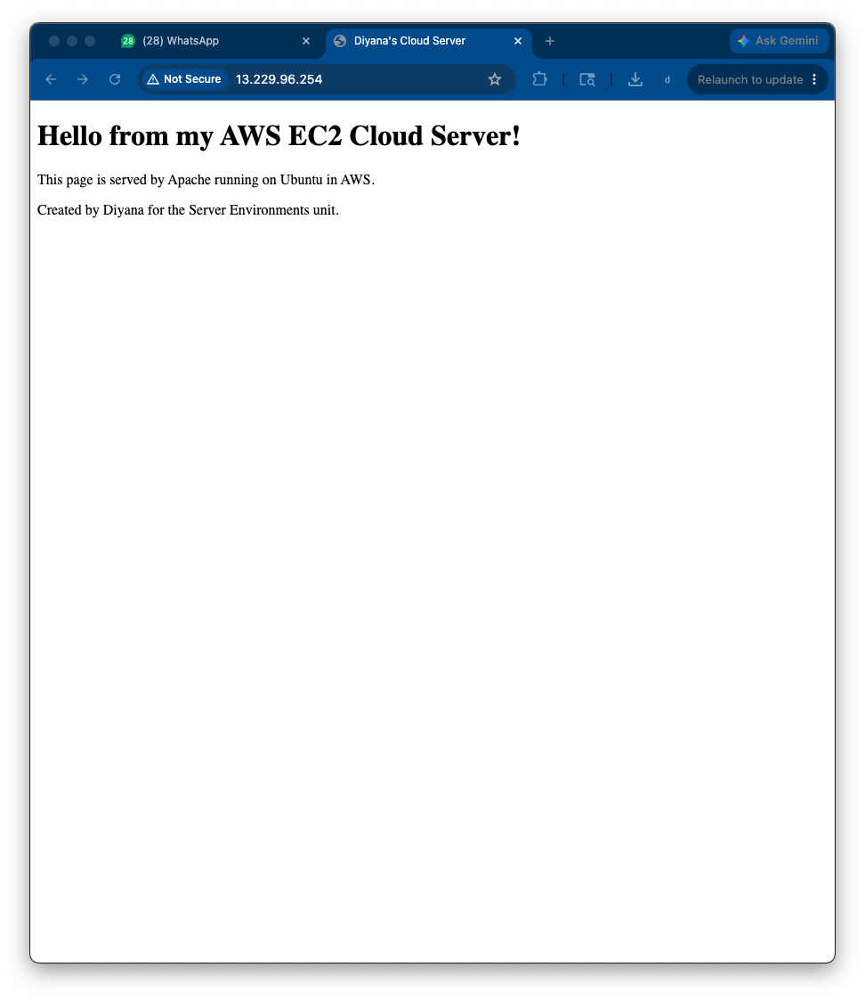

# 2b-1 Cloud Computing — AWS EC2 Apache Web Server Deployment

**Unit:** Introduction to Server Environments and Architectures
**Platform:** Amazon Web Services (EC2), Ubuntu, Apache

This lab deploys a real Linux web server in the cloud using AWS EC2, installs
Apache, serves a custom web page and a downloadable file over the internet, and
covers cost monitoring and safe shutdown.

---

## 1. EC2 Instance Launched (Deliverable 1)

An Ubuntu instance (free-tier eligible) was launched from the EC2 console, with
state showing **running**.


---

## 2. Security Group Configured (Deliverable 2)

The security group `ssh-and-web` was configured with inbound rules allowing:
- **Port 22 (SSH)** — for remote terminal access
- **Port 80 (HTTP)** — for web traffic


---

## 3. SSH Access (Deliverable 3)

Connected to the instance from the terminal using the `.pem` key pair:

```bash
ssh -i "yourkey.pem" ubuntu@<public_dns>
```


---

## 4. Apache Installed & Tested (Deliverable 4)

```bash
sudo apt update
sudo apt install apache2 -y
sudo systemctl status apache2      # active (running)
```

The default Apache page was verified in a browser at `http://<public_ip>`.


---

## 5. Custom index.html (Deliverable 5)

The home page was replaced with custom content:

```bash
sudo nano /var/www/html/index.html
```
```html
<!DOCTYPE html>
<html>
<head><title>Diyana's Cloud Server</title></head>
<body>
  <h1>Hello from my AWS EC2 Cloud Server!</h1>
  <p>This page is served by Apache running on Ubuntu in AWS.</p>
</body>
</html>
```



---

## 6 & 7. File Downloaded with wget & Copied to Web Root (Deliverables 6 & 7)

A file was downloaded onto the server and placed in Apache's web directory.

```bash
cd ~                                                  # writable home directory
wget https://www.gutenberg.org/files/1342/1342-0.txt  # download onto server
sudo cp 1342-0.txt /var/www/html/book.txt             # copy into web root (needs sudo)
ls -l /var/www/html/                                   # confirm it is there
```

> **Permissions note:** Running `wget` directly inside `/var/www/html` failed with
> "Permission denied", because that folder is owned by **root** and the `ubuntu`
> user cannot write to it. The fix was to download into the home directory (which
> the user owns) and then use `sudo cp` to place the file in the root-owned web
> folder. This is a real example of working *with* Linux file permissions.


---

## 8 & 9. File Accessible via Browser + Link in HTML (Deliverables 8 & 9)

A hyperlink to the file was added to the page:

```html
<p><a href="book.txt">Click here to download the book</a></p>
```

The file is then reachable from any browser:
```
http://<public_ip>/book.txt
```


---

## 10. Budget Monitoring Enabled (Deliverable 10)

A budget alert was created in the AWS Billing & Cost Management console to warn of
any unexpected charges.


---

## 11. Instance Terminated (Deliverable 11)

After capturing all evidence, the instance was **terminated** to avoid ongoing
charges and free-tier usage.


---

## Reflection

**Benefits of cloud deployment over local virtualisation?**
The cloud server has a **public IP**, so it is reachable from anywhere on the
internet, unlike a local VM which is only visible on my own machine. It also
needs no local hardware resources, can be scaled or replaced quickly, and is
managed entirely through the AWS console.

**How does Apache serve files, and how did I verify this?**
Apache serves any file placed in its web root (`/var/www/html/`) over HTTP on
port 80. I verified this by visiting the public IP in a browser and seeing first
the default page, then my custom `index.html`, then successfully downloading
`book.txt` — proving the file was being served from the server.

**What did I learn about file ownership and permissions?**
The web root is owned by **root**, so a normal user cannot write to it directly.
I learned to download files to a location I own and then use `sudo` to copy them
into the protected web folder, rather than trying to override the permissions.

**What risks come from leaving instances running?**
A running instance keeps **incurring charges** and consuming free-tier hours even
when idle. Leaving it on can lead to unexpected bills, and an exposed server is
also a **security risk** if left unmonitored. Terminating it when finished avoids
both.

**How would I explain DNS vs /etc/hosts to a client?**
`/etc/hosts` is a small local file on a single machine that maps names to IP
addresses for *that machine only*. **DNS** is the global, internet-wide system
that does the same mapping for *everyone*, so that names like `example.com`
resolve to the correct server worldwide.

---

## Files in this folder
- All screenshots (named `2b1_*.png`)
- `index.html` — the custom web page used
- This `README.md`
