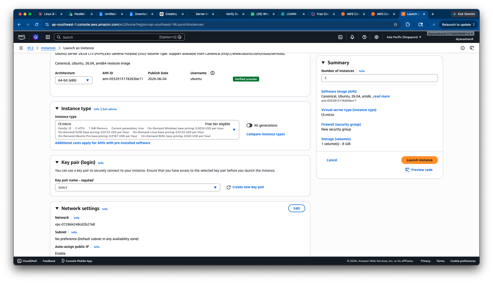
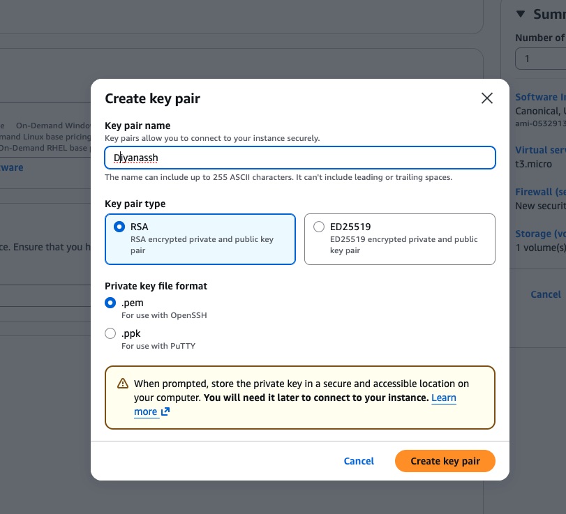
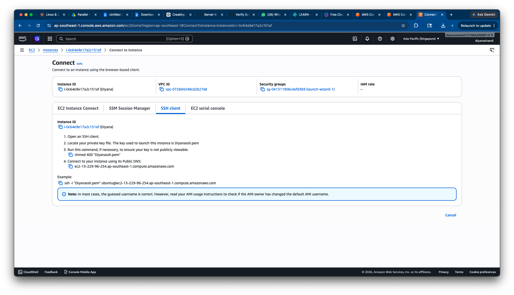
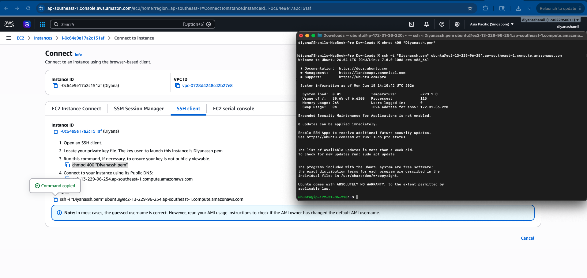
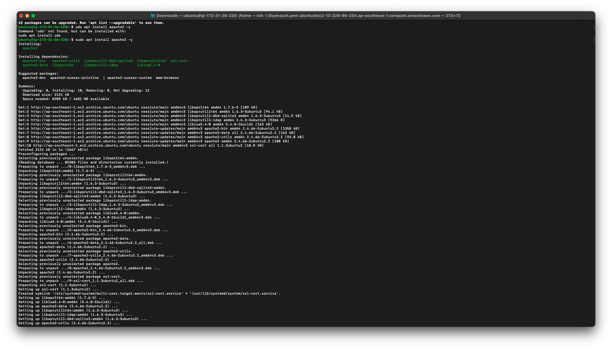
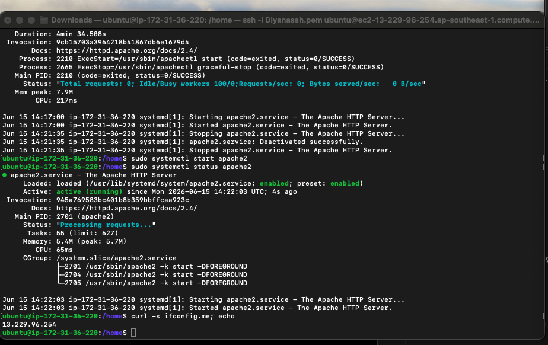
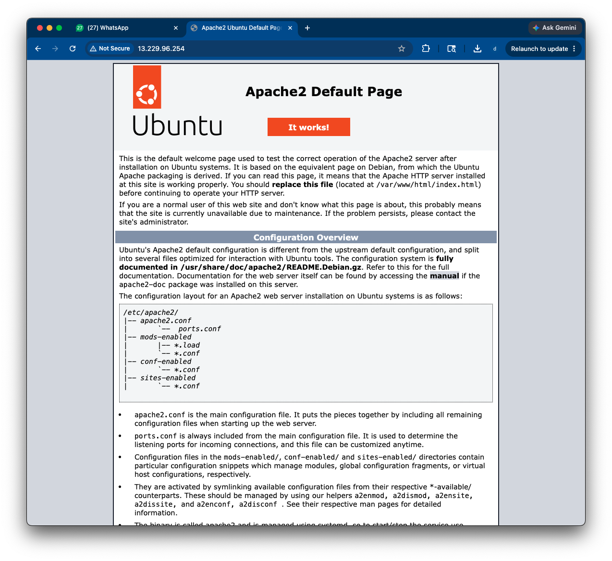
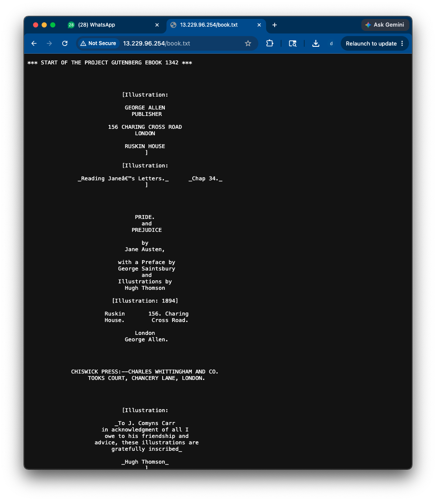
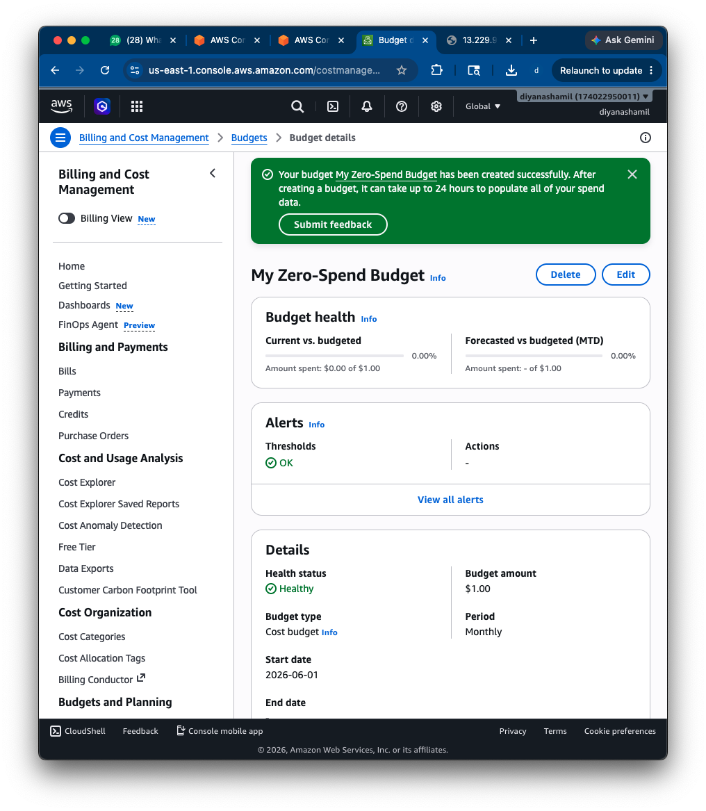
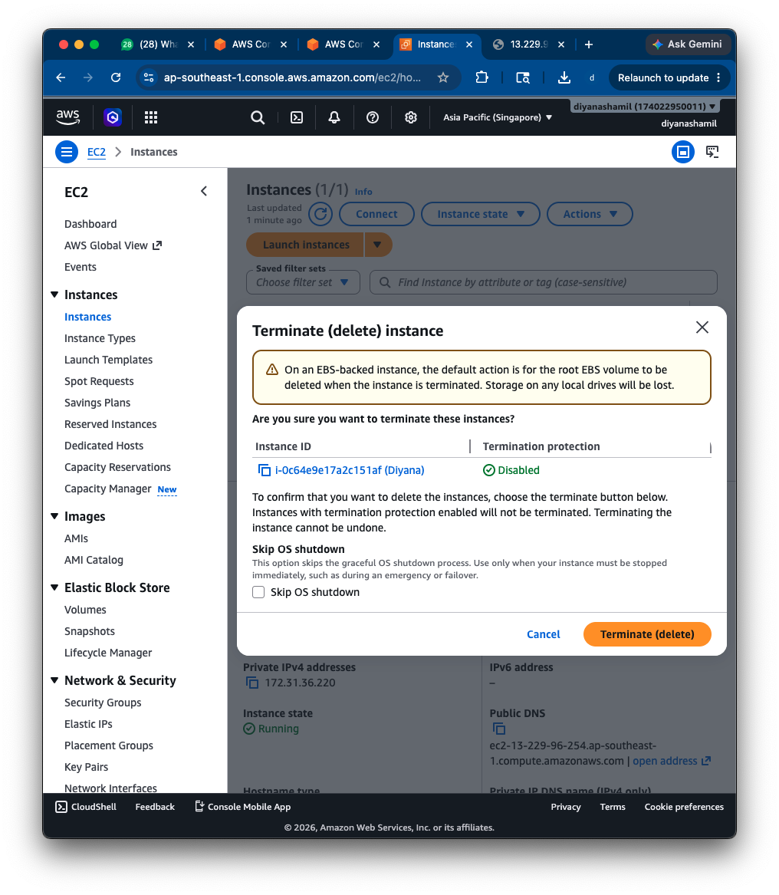

# 2b-1 Cloud Computing — AWS EC2 Apache Web Server Deployment

**Unit:** Introduction to Server Environments and Architectures
**Platform:** AWS EC2 · Ubuntu 26.04 LTS · Apache · Region: Asia Pacific (Singapore)
**Instance:** `i-0c64e9e17a2c151af` (Diyana) · Public IP `13.229.96.254`

This lab deploys a real Linux web server in the cloud using AWS EC2, installs
Apache, serves a custom web page and a downloadable file over the internet, and
covers cost monitoring and safe shutdown.

---

## 1. EC2 Instance Launched (Deliverable 1)

An Ubuntu instance was launched from the EC2 console — **t3.micro (free-tier
eligible)**, Ubuntu 26.04 LTS (amd64), 8 GiB storage, with a new security group
and a public IP enabled.



---

## 2. Key Pair Created (Deliverable 2 / 3)

An **RSA** key pair (`Diyanassh.pem`, `.pem` format for OpenSSH) was created and
downloaded to be used for secure SSH login.



> The instance was placed in security group `launch-wizard-1`
> (`sg-041311906c4afd3b9`) with inbound access for SSH (port 22) and HTTP
> (port 80).

---

## 3. SSH Access Successful (Deliverable 3)

The AWS console provides the exact SSH command using the `.pem` key:

```bash
chmod 400 "Diyanassh.pem"
ssh -i "Diyanassh.pem" ubuntu@ec2-13-229-96-254.ap-southeast-1.compute.amazonaws.com
```



Login was successful, showing the **Welcome to Ubuntu 26.04 LTS** banner and the
server prompt `ubuntu@ip-172-31-36-220`.



---

## 4. Apache Installed & Tested (Deliverable 4)

```bash
sudo apt update
sudo apt install apache2 -y
```



Service status confirmed **active (running)**, and the public IP was retrieved
with `curl -s ifconfig.me` → `13.229.96.254`:

```bash
sudo systemctl status apache2     # active (running)
curl -s ifconfig.me; echo         # 13.229.96.254
```



The default Apache page was verified in a browser at `http://13.229.96.254`
showing **"Apache2 Default Page — It works!"**



---

## 5. Custom index.html (Deliverable 5)

The home page was replaced with custom content:

```bash
sudo nano /var/www/html/index.html
```
```html
<!DOCTYPE html>
<html>
<head><title>Diyana's Cloud Server</title></head>
<body>
  <h1>Hello from my AWS EC2 Cloud Server!</h1>
  <p>This page is served by Apache running on Ubuntu in AWS.</p>
  <p>Created by Diyana for the Server Environments unit.</p>
</body>
</html>
```


---

## 6, 7 & 8. File Downloaded with wget, Copied to Web Root & Served (Deliverables 6–8)

A file was downloaded onto the server and placed in Apache's web directory:

```bash
cd ~                                                  # writable home directory
wget https://www.gutenberg.org/files/1342/1342-0.txt  # download onto server
sudo cp 1342-0.txt /var/www/html/book.txt             # copy into web root (needs sudo)
ls -l /var/www/html/                                   # confirm it is there
```

> **Permissions note:** Running `wget` directly inside `/var/www/html` first
> failed with "Permission denied", because that folder is owned by **root** and
> the `ubuntu` user cannot write to it. The fix was to download into the home
> directory (which the user owns) and then use `sudo cp` to place the file in the
> root-owned web folder — working *with* Linux file permissions rather than
> against them.

The file is then reachable from any browser at `http://13.229.96.254/book.txt`,
which serves the Project Gutenberg text directly from the server.



---

## 10. Budget Monitoring Enabled (Deliverable 10)

A **Zero-Spend / $1 monthly budget** was created in AWS Billing & Cost Management
to alert on any unexpected charges.



---

## 11. Instance Terminated (Deliverable 11)

After capturing all evidence, the instance was **terminated** to avoid ongoing
charges and free-tier usage.



---

## Reflection

**Benefits of cloud deployment over local virtualisation?**
The cloud server has a **public IP** (`13.229.96.254`), so it is reachable from
anywhere on the internet, unlike a local VM that is only visible on my own
machine. It also needs no local hardware, can be launched or replaced in minutes,
and is managed entirely through the AWS console.

**How does Apache serve files, and how did I verify this?**
Apache serves any file placed in its web root (`/var/www/html/`) over HTTP on
port 80. I verified this by visiting the public IP in a browser and seeing first
the default page, then my custom `index.html`, then successfully loading
`book.txt` — proving the file was served from the server.

**What did I learn about file ownership and permissions?**
The web root is owned by **root**, so a normal user cannot write to it directly.
I learned to download files to a location I own and then use `sudo` to copy them
into the protected web folder, rather than trying to override the permissions.

**What risks come from leaving instances running?**
A running instance keeps **incurring charges** and consuming free-tier hours even
when idle, which can lead to unexpected bills, and an exposed server is also a
**security risk**. Terminating it when finished avoids both — which is why the
budget alert and termination steps matter.

**How would I explain DNS vs /etc/hosts to a client?**
`/etc/hosts` is a small local file on a single machine that maps names to IPs for
*that machine only*. **DNS** is the global, internet-wide system that does the
same mapping for *everyone*, so names like the EC2 public DNS resolve to the
correct server worldwide.

---

## Screenshots in this folder
| File | Shows |
|---|---|
| `2b-1-Cloud-Computing-1.png` | EC2 launch configuration |
| `2b-1-Cloud-Computing-2.png` | Key pair creation |
| `2b-1-Cloud-Computing-3.png` | SSH connect instructions |
| `2b-1-Cloud-Computing-4.png` | Successful SSH login |
| `2b-1-Cloud-Computing-5.png` | Apache install |
| `2b-1-Cloud-Computing-6.png` | Apache running + public IP |
| `2b-1-Cloud-Computing-7.png` | Apache default page |
| `2b1_custom_page.png` | Custom index.html |
| `2b-1-Cloud-Computing-8.png` | book.txt served via browser |
| `2b-1-Cloud-Computing-9.png` | Budget alert |
| `2b-1-Cloud-Computing-10.png` | Instance terminated |
