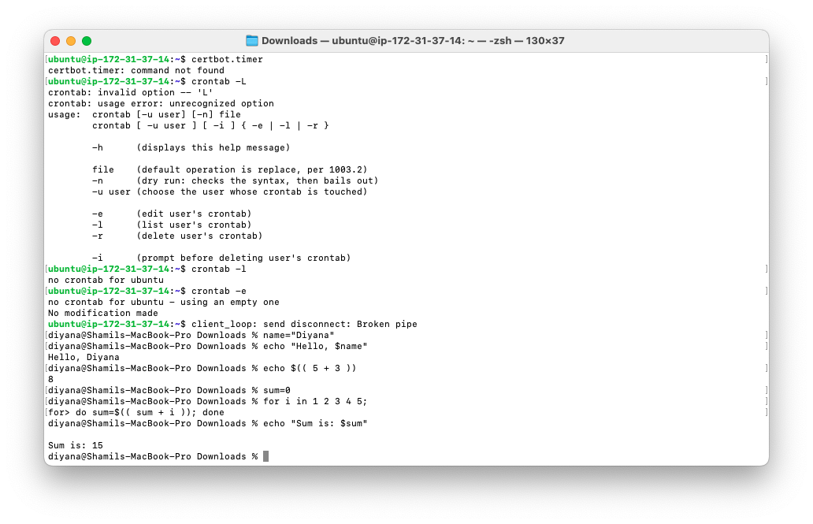
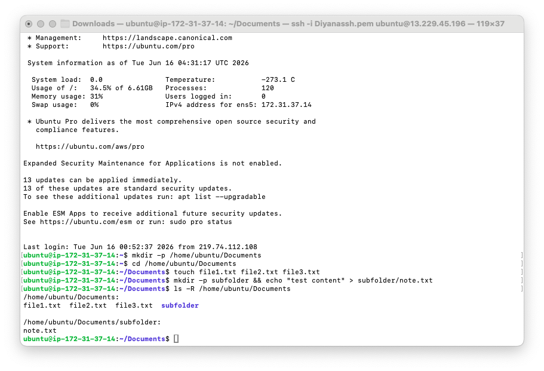
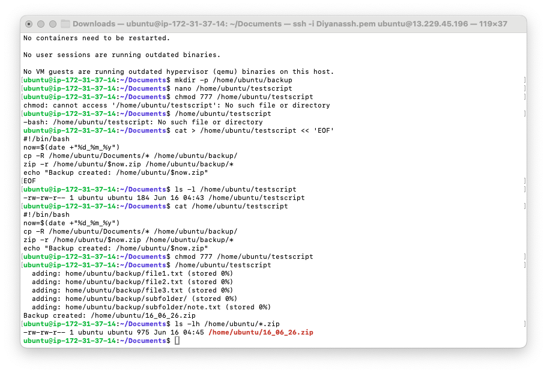
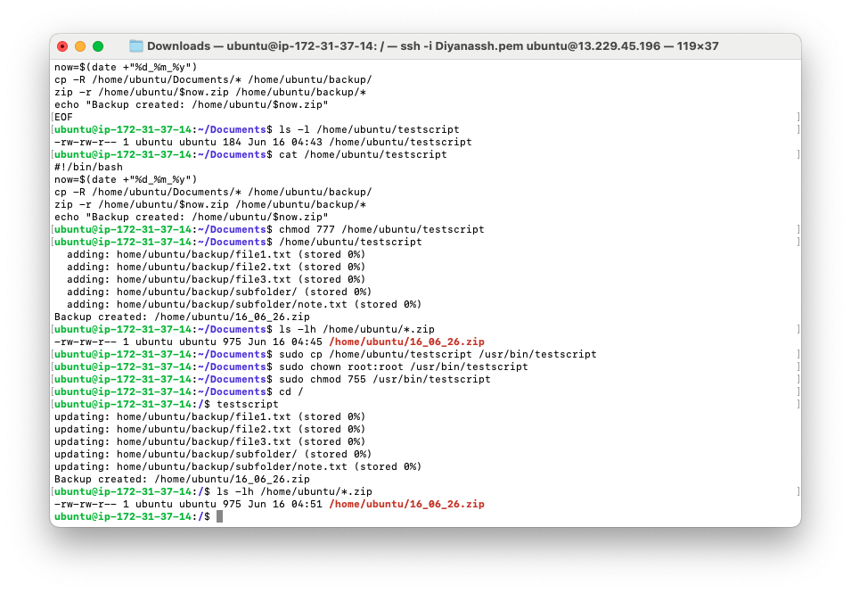
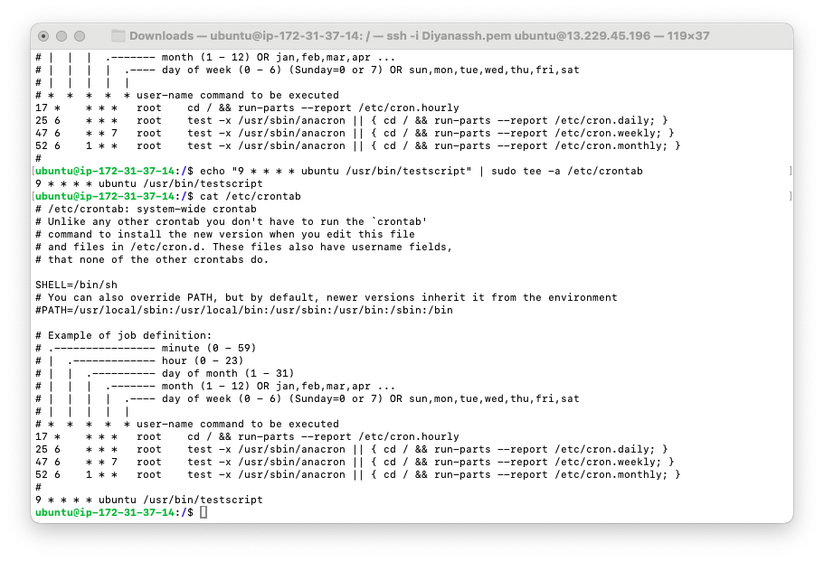
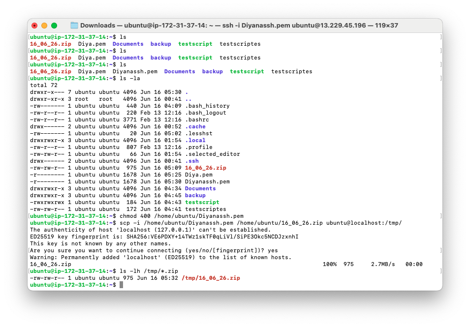

# 3b-1 Bash Backup Scripting & Cron Jobs

**Unit:** Introduction to Server Environments and Architectures
**Server:** AWS EC2 · Ubuntu · `ubuntu@ip-172-31-37-14` · Public IP `13.229.45.196`

This lab automates a file backup using a Bash script, makes it available
system-wide, and schedules it to run automatically with cron.

---

## Deliverable 1 — Practice Bash Commands

```bash
name="Diyana"; echo "Hello, $name"        # variables + echo
echo $(( 5 + 3 ))                          # arithmetic
sum=0; for i in 1 2 3 4 5; do sum=$(( sum + i )); done; echo "Sum is: $sum"
```



---

## Deliverable 2 — Test Files & Directories Created

```bash
mkdir -p /home/ubuntu/Documents
cd /home/ubuntu/Documents
touch file1.txt file2.txt file3.txt
mkdir -p subfolder && echo "test content" > subfolder/note.txt
ls -R /home/ubuntu/Documents
```

The `-R` (recursive) listing confirms files and a nested subfolder:
```
Documents/
├── file1.txt
├── file2.txt
├── file3.txt
└── subfolder/
    └── note.txt
```



---

## Deliverable 3 & 5 — Backup Script with Dated ZIP

The script copies `Documents/` to `backup/`, then compresses it into a ZIP named
with the current date.

```bash
#!/bin/bash
now=$(date +"%d_%m_%y")
cp -R /home/ubuntu/Documents/* /home/ubuntu/backup/
zip -r /home/ubuntu/$now.zip /home/ubuntu/backup/*
echo "Backup created: /home/ubuntu/$now.zip"
```

```bash
chmod 777 /home/ubuntu/testscript
/home/ubuntu/testscript
ls -lh /home/ubuntu/*.zip          # e.g. 16_06_26.zip
```

The date filename comes from `date +"%d_%m_%y"` → `16_06_26.zip` (day_month_year).



---

## Deliverable 4 — Script Moved to /usr/bin (System-Wide)

```bash
sudo cp /home/ubuntu/testscript /usr/bin/testscript
sudo chown root:root /usr/bin/testscript
sudo chmod 755 /usr/bin/testscript
cd /
testscript                         # runs from any directory, no path needed
```

Because `/usr/bin` is on the system `PATH`, the script now runs as a command from
anywhere — proven by running it from `/`.



---

## Deliverable 6 — Cron Job for Hourly Backup

```bash
echo "9 * * * * ubuntu /usr/bin/testscript" | sudo tee -a /etc/crontab
cat /etc/crontab
```

The cron entry runs the backup at minute 9 of every hour:
```
9     *     *     *     *     ubuntu   /usr/bin/testscript
min   hour  day   month weekday user   command
```

`cron` confirmed active and running with `sudo systemctl status cron`.



---

## Deliverable 7 — Cron Execution Verified

After the scheduled minute passes, the ZIP's timestamp updates automatically,
confirming cron ran the script without manual intervention:
```bash
ls -lh /home/ubuntu/*.zip          # timestamp updates each hour
```

---

## Deliverable 8 & 9 — SCP Transfer + SSH Key Acceptance

The dated backup was transferred to a remote destination over SSH using `scp`
with the key file. The script's `scp -i key.pem ...` pattern requires the key to
be present, so the `.pem` was placed on the server first.

```bash
# Lock down the key
chmod 400 /home/ubuntu/Diyanassh.pem

# Transfer the backup over SCP (key-based, to a remote destination)
scp -i /home/ubuntu/Diyanassh.pem /home/ubuntu/16_06_26.zip ubuntu@localhost:/tmp/
```

On the first connection, SSH asked to confirm the host fingerprint
(**Deliverable 9** — SSH key acceptance):
```
Are you sure you want to continue connecting (yes/no/[fingerprint])? yes
Warning: Permanently added 'localhost' (ED25519) to the list of known hosts.
16_06_26.zip                              100%  975   2.7MB/s
```


The transfer was confirmed at the destination (**Deliverable 8**):
```bash
ls -lh /tmp/*.zip          # -> /tmp/16_06_26.zip
```



> **Why the fingerprint prompt matters:** the first SSH/SCP connection to a new
> host must be confirmed manually, which adds the host to `known_hosts`. In an
> automated cron job there is nobody to type `yes`, so the key must be accepted
> beforehand for unattended transfers to work — this is the lesson behind
> Deliverable 9. A real deployment would target a separate cloud server's public
> IP instead of `localhost`.

---

## Optional (not completed)

- **Deliverable 12 — MOTD with figlet / neofetch:** customise the login banner.

---

## Reflection

**Why are absolute paths important in scripts run by cron?**
Cron runs scripts in a minimal environment with a different working directory and
limited `PATH`, so relative paths often fail. Using full paths (e.g.
`/home/ubuntu/Documents` and `/usr/bin/testscript`) ensures the script finds the
right files and commands no matter where or how cron runs it.

**How does cron differ from manual execution?**
Manual execution runs once, when you type the command, in your own shell
environment. Cron runs the script **automatically on a schedule**, unattended, in
a stripped-down environment — which is why absolute paths and explicit settings
matter.

**What are the benefits of cloud exporting for backups?**
Storing a copy off the local machine protects against hardware failure, theft, or
deletion. A backup kept only on the same server is lost if that server fails, so
exporting to a separate cloud location provides redundancy and disaster recovery.

**What happens if SSH keys are not accepted ahead of time?**
The first SSH/SCP connection prompts to confirm the host fingerprint. In an
automated cron job there is no one to answer that prompt, so the transfer fails.
Accepting the key beforehand (so it's in `known_hosts`) lets the automated
transfer run silently.

**How can login messages (MOTD) help engagement?**
A customised message of the day (via `figlet`/`neofetch`) can show useful system
info at login and give the server a clear identity, which helps administrators
quickly confirm which machine they're on.

**What challenges came with automating via cron, and how to improve for
production?**
The main challenge was ensuring absolute paths and correct permissions so the job
runs unattended. For production I would add error handling and logging (write
output to a log file), timestamp each backup uniquely so they don't overwrite,
rotate/clean old backups, and securely off-site the archives.

---

## Screenshots in this folder
| File | Shows |
|---|---|
| `3b1_practice.png` | Bash practice commands |
| `3b1_testfiles.png` | Test files + subfolder |
| `3b1_script_run.png` | Backup script + dated ZIP |
| `3b1_usrbin.png` | Script running from /usr/bin |
| `3b1_cron.png` | Cron entry in /etc/crontab |
| `3b1_scp.png` | SCP transfer + fingerprint acceptance |
| `3b1_scp_confirm.png` | File confirmed at destination |
