# 3a — DNS & HTTPS (Let's Encrypt TLS Certificate)

**Unit:** Introduction to Server Environments and Architectures
**Server:** AWS EC2 · Ubuntu · Apache · Public IP `13.229.45.196`
**Domain:** `diyana.duckdns.org` (free, via DuckDNS)

> Replace `diyana.duckdns.org` with your actual subdomain if different.

This lab links a domain name to a cloud server using DNS, then secures it with a
free TLS certificate from Let's Encrypt so the site loads over HTTPS.

---

# Part 1 — 3a-1 Domain & DNS

## Deliverable 1 & 2 — Domain Registered + A Record (DuckDNS)

A free subdomain `diyana.duckdns.org` was created on DuckDNS and pointed to the
EC2 server's public IP (`13.229.45.196`) by setting the **current ip** field — this
acts as the DNS **A record** mapping the name to the server.

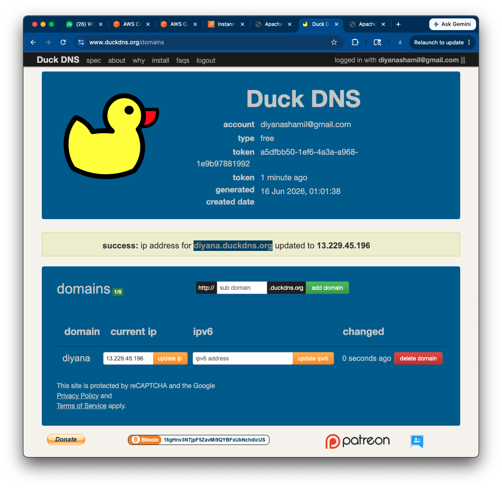

## Deliverable 3 — Apache Installed

```bash
sudo apt update
sudo apt install apache2 -y
curl -s ifconfig.me; echo        # 13.229.45.196
```

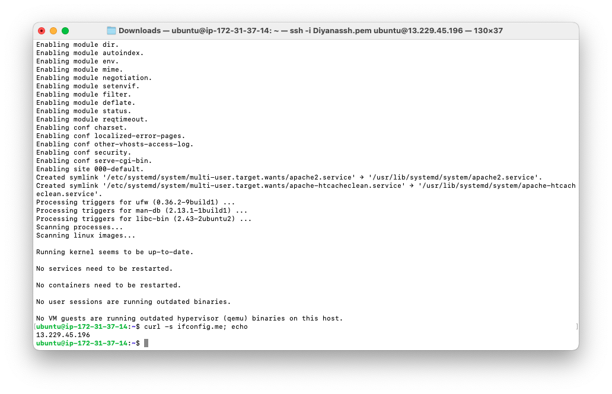

The Apache default page loads at the raw IP `http://13.229.45.196`:

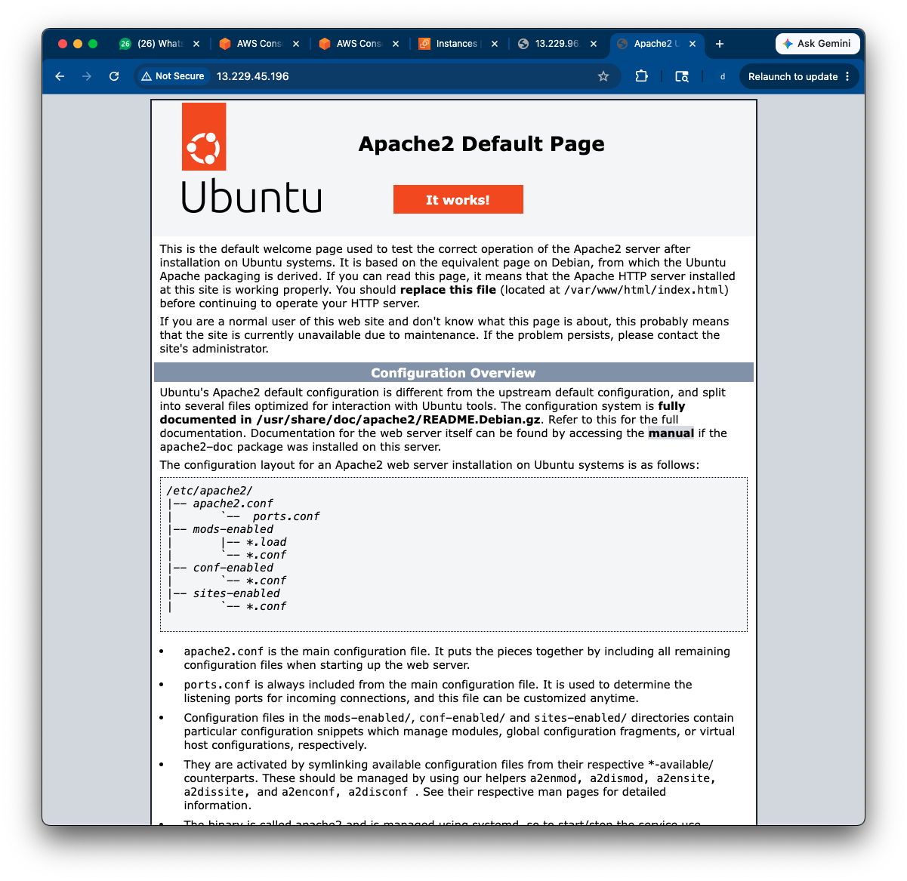

## Deliverable 4 & 6 — DNS Resolution Verified

```bash
nslookup diyana.duckdns.org      # returns 13.229.45.196
dig diyana.duckdns.org +short    # returns 13.229.45.196
ping -c 3 diyana.duckdns.org     # pings 13.229.45.196
```

The domain correctly resolves to the server's public IP, confirming DNS is working.

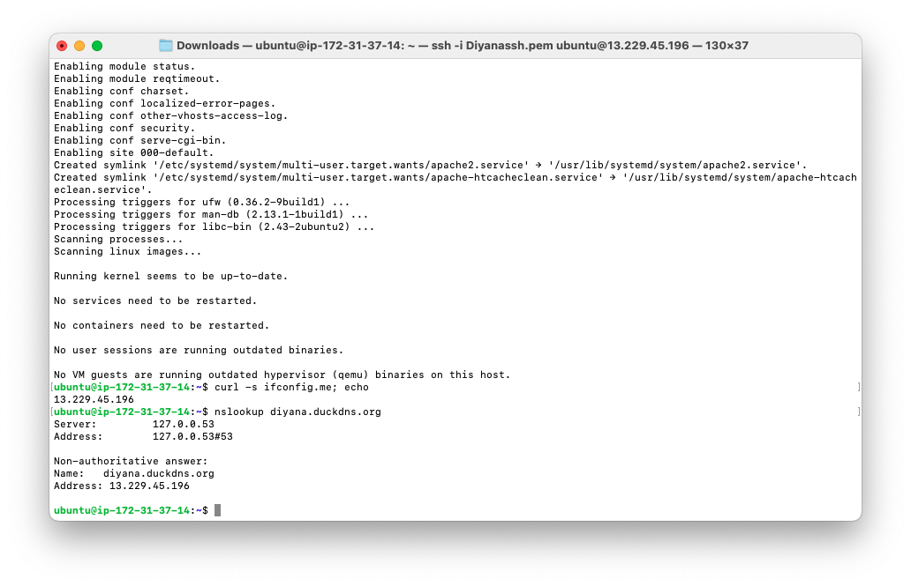
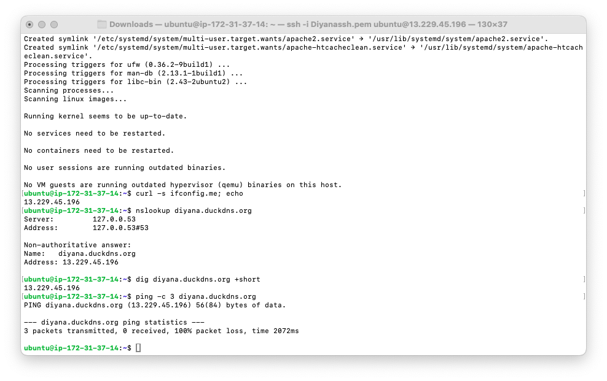
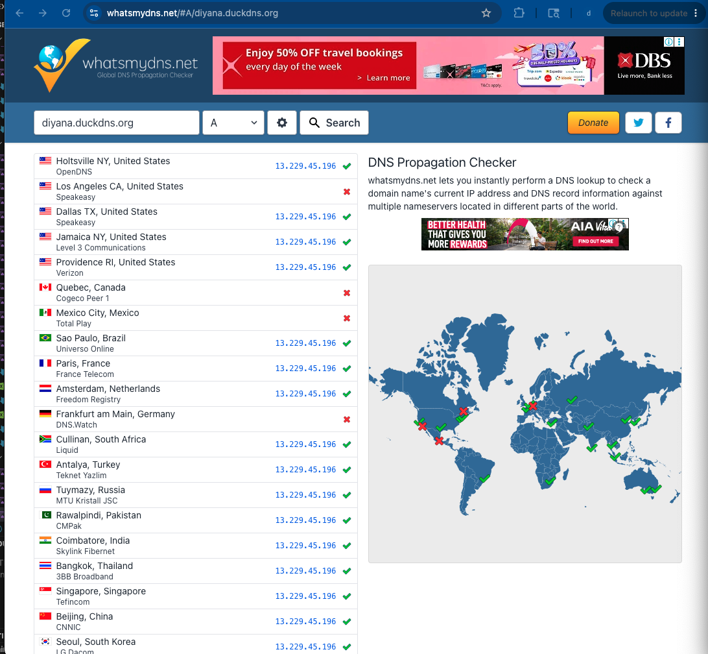

## Deliverable 5 — Apache Welcome Page via Domain

Visiting `http://diyana.duckdns.org` shows the Apache2 default page — served via the
domain name instead of the raw IP.

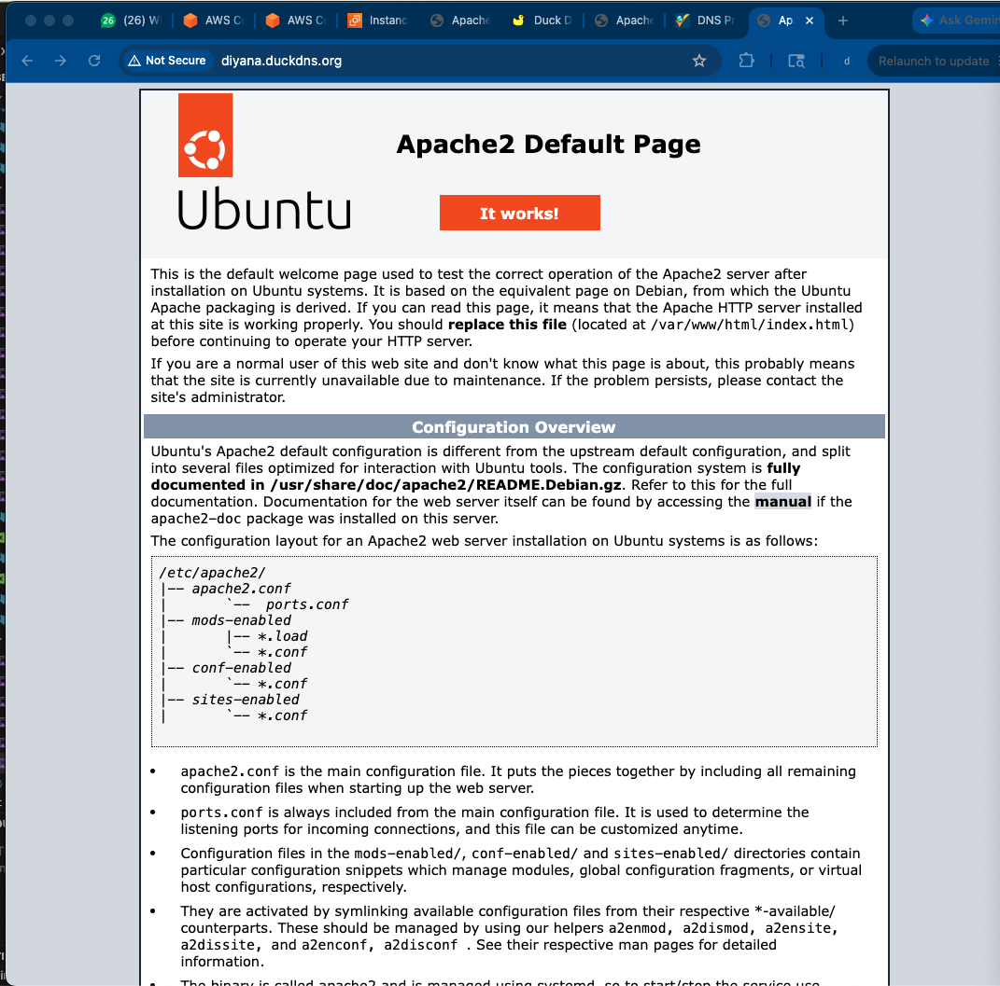

---

# Part 2 — 3a-2 Let's Encrypt TLS Certificate

## Deliverable 1 — Certbot Installed

```bash
sudo apt update
sudo apt install certbot python3-certbot-apache -y
```

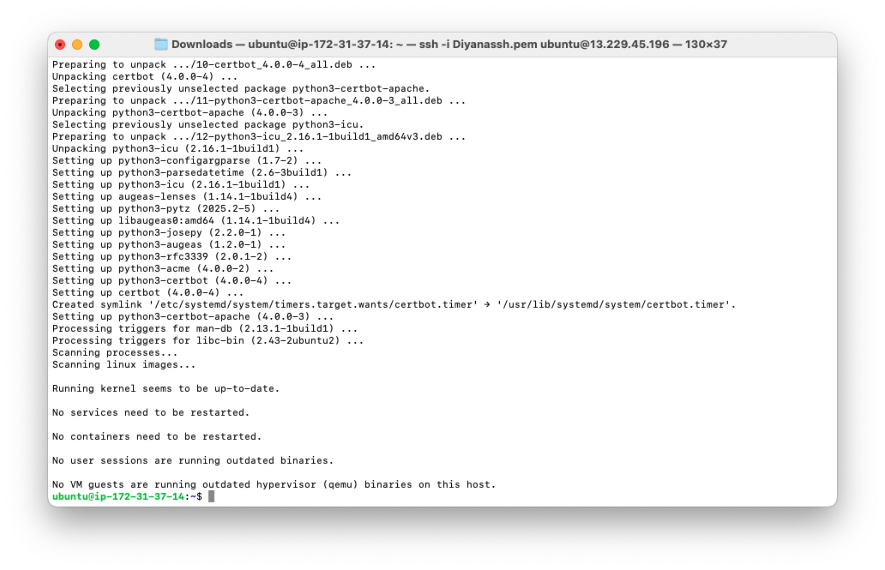

## Deliverable 2, 3 & 5 — Certificate Issued + HTTPS Enabled

```bash
sudo certbot --apache
```
Certbot prompted for email, agreement to terms, and the domain, then verified
ownership, issued the certificate, configured Apache for HTTPS, and enabled the
HTTP→HTTPS redirect. The success message confirms the certificate was deployed.

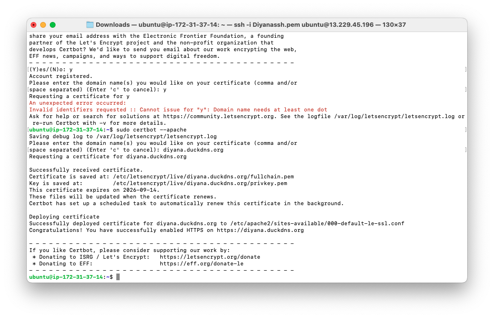

## Deliverable 4 & 6 — HTTPS Padlock + Let's Encrypt Issuer

Visiting `https://diyana.duckdns.org` now shows a **padlock** and "Secure"
connection. Clicking the padlock and viewing the certificate confirms the
**issuer is Let's Encrypt**.

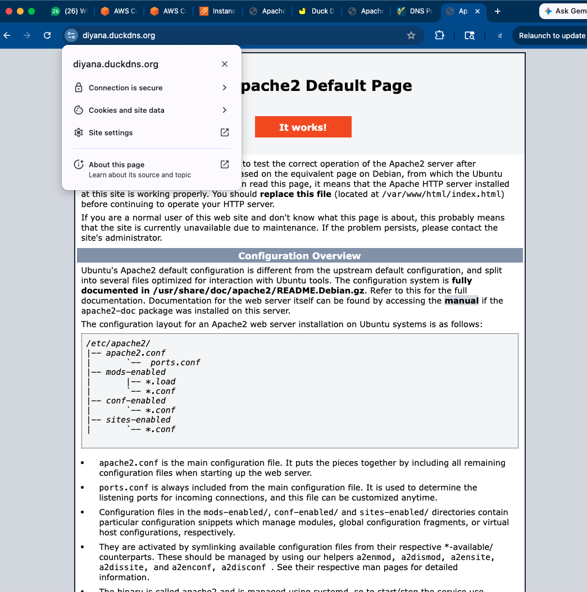
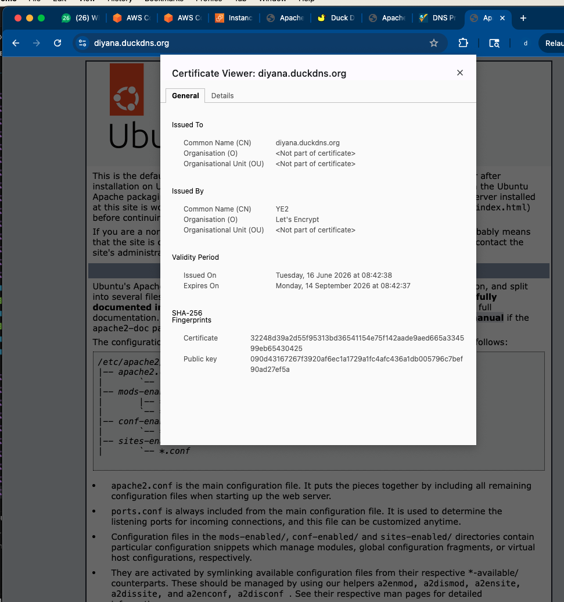

## Deliverable 7 — Auto-Renewal Dry-Run

```bash
sudo certbot renew --dry-run
systemctl list-timers | grep certbot
```

The dry-run reports **"Congratulations, all renewals succeeded"**, and a systemd
timer is scheduled to renew the certificate automatically (Let's Encrypt certs are
valid 90 days and auto-renew).

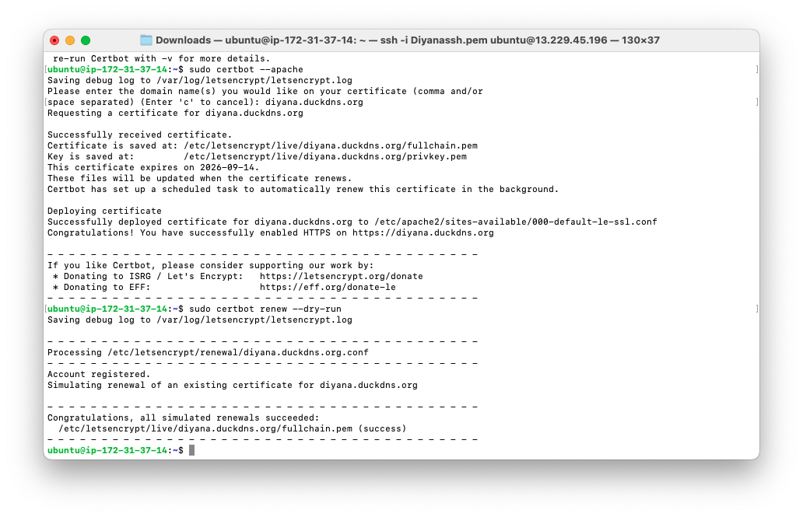
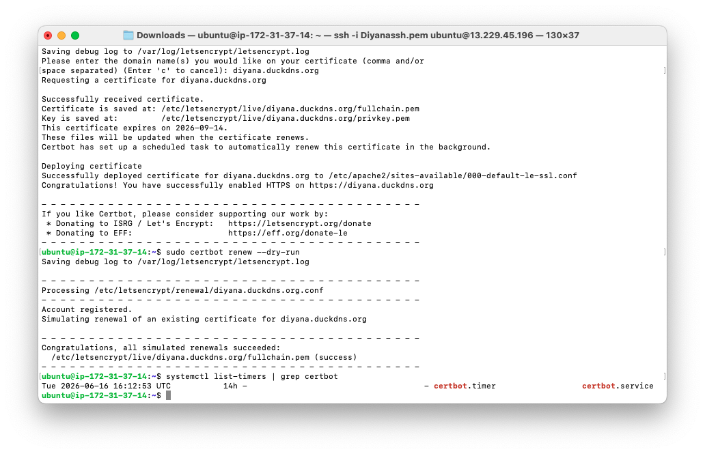

---

## Reflection

**What is DNS, and what is its role?**
DNS (Domain Name System) is the internet's address book — it translates
human-friendly names like `diyana.duckdns.org` into the numeric IP address of the
server (`13.229.45.196`). Without it, users would have to remember raw IPs.

**What is a domain name?**
A human-readable address for a server or service on the internet, which DNS maps
to an IP address.

**Why does DNS propagation take time?**
DNS records are cached at many servers across the internet with a time-to-live
(TTL). Until those caches expire, some resolvers may still return old data, so a
new or changed record can take minutes to hours to be seen everywhere.

**What is SSL/TLS, and why HTTPS instead of HTTP?**
TLS (formerly SSL) encrypts traffic between the browser and server. HTTPS is HTTP
over TLS, so data (logins, form data) can't be read or tampered with in transit.
HTTP sends everything in plain text, which is insecure.

**What does Let's Encrypt provide, and how does it validate ownership?**
Let's Encrypt is a free certificate authority that issues TLS certificates. It
validates ownership by challenging the server to prove control of the domain —
typically by serving a token over port 80 (HTTP-01), which only the real server
behind that domain can do. This is why port 80/443 must be open.

**How long is the certificate valid, and how is it renewed?**
Let's Encrypt certificates are valid for **90 days**. Certbot installs a systemd
timer that renews them automatically before expiry; `certbot renew --dry-run`
tests that this will succeed.

**What happens if TLS isn't configured / the certificate expires?**
Without TLS, traffic is unencrypted and the browser shows "Not Secure", exposing
users to eavesdropping and tampering. If a certificate expires and isn't renewed,
browsers show a security warning and may block access until it's renewed.

**What could happen if you leave the cloud VM running for months?**
It keeps incurring charges and consuming free-tier hours, risks unexpected bills,
and an unmonitored public server is a security risk — which is why idle instances
should be stopped or terminated.

---

## Screenshots in this folder
| File | Shows |
|---|---|
| `3a1_duckdns_created.png` | DuckDNS domain → server IP |
| `3a1_apache_ip.png` | Apache installed + public IP |
| `3a1_apache_default.png` | Apache default page via IP |
| `3a1_nslookup.png` | nslookup / dig resolution |
| `3a1_ping.png` | ping to domain |
| `3a1_duckdns_propogation.png` | DNS propagation |
| `3a1_browser_domain.png` | Apache page via domain |
| `3a2_certbot_install.png` | Certbot install |
| `3a2_certbot_success.png` | Certificate issued |
| `3a2_https_padlock.png` | HTTPS padlock |
| `3a2_cert_issuer.png` | Issuer = Let's Encrypt |
| `3a2_renew_dryrun.png` | Renewal dry-run success |
| `3a2_timer.png` | Auto-renewal timer |
