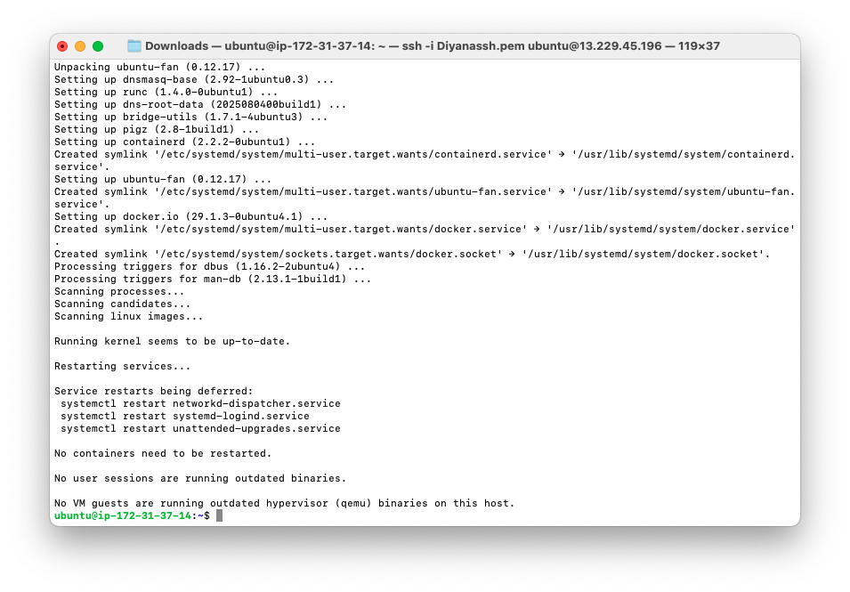
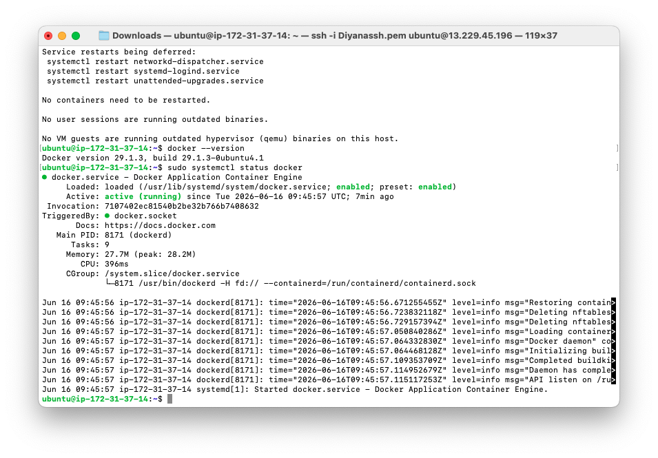
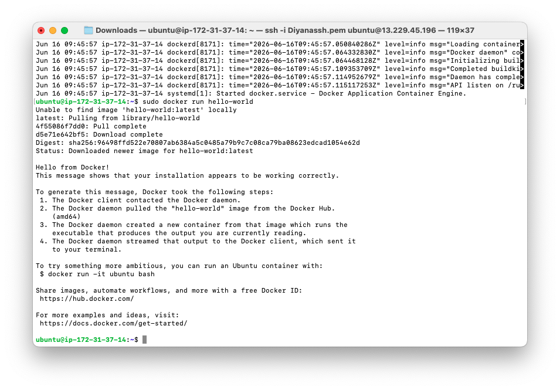
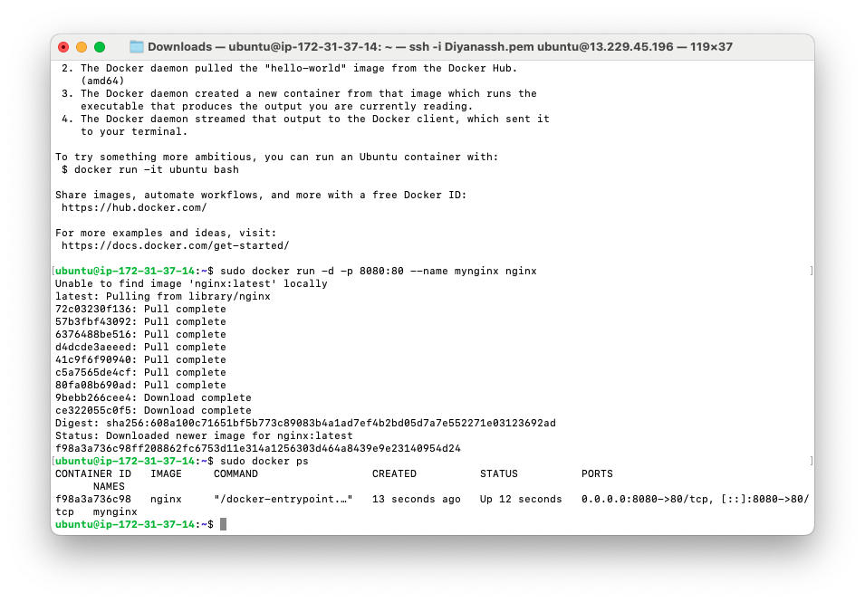
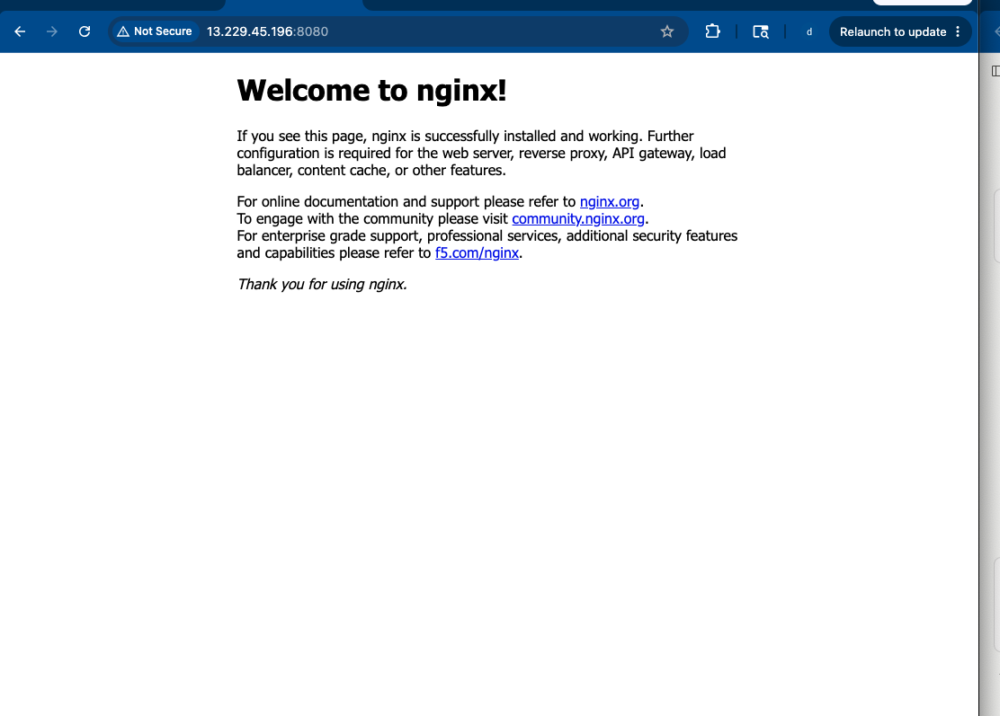

# 3b-2 Additional Server Service — Docker

**Unit:** Introduction to Server Environments and Architectures
**Server:** AWS EC2 · Ubuntu · `ubuntu@ip-172-31-37-14` · Public IP `13.229.45.196`
**Additional service chosen:** Docker (container platform)

For the "additional server service" requirement, **Docker** was installed and used
to run containers on the cloud server, including a live Nginx web server inside a
container.

---

## What is Docker, and why use it?

**Docker** packages an application together with all its dependencies into a
self-contained unit called a **container**, which runs identically on any machine
that has Docker. This solves the classic "it works on my machine" problem — an app
and its exact libraries travel together, so version conflicts disappear.

**Why it's useful:**
- **Isolation** — each container has its own dependencies, so apps that need
  different library versions can run side by side on one OS without conflict.
- **Portability** — the same container runs the same in dev, test, and production.
- **Clean host** — software runs inside containers, so trying or removing it
  doesn't pollute the host OS.
- **Fast deployment** — ship a container and it just runs.

**Key concept — where Docker sits:** Docker is installed *directly on the OS*
(Ubuntu), at the same level as Apache. Containers run *inside* the Docker engine.
Docker shares the host's Linux kernel, so it isolates an app's libraries/runtimes
but is for Linux workloads (a Windows `.exe` would need a full VM, not Docker).

---

## Step 1 — Install Docker

```bash
sudo apt update
sudo apt install docker.io -y
```



## Step 2 — Verify Installation

```bash
docker --version              # shows the installed version
sudo systemctl status docker  # active (running)
```



## Step 3 — Run a Test Container (`hello-world`)

```bash
sudo docker run hello-world
```

Docker pulled the `hello-world` image from Docker Hub, created a container from
it, ran it, and printed the confirmation message — proving the full pipeline
(client → daemon → image pull → container → output) works.



## Step 4 — Run a Real Service in a Container (Nginx)

```bash
sudo docker run -d -p 8080:80 --name mynginx nginx
sudo docker ps
```

- `-d` runs it in the background
- `-p 8080:80` maps the host's port 8080 to the container's port 80
- `--name mynginx` names the container

`docker ps` confirmed the container running, with port mapping
`0.0.0.0:8080->80/tcp`.



## Step 5 — Access the Container in a Browser

After opening port **8080** in the EC2 security group, visiting
`http://13.229.45.196:8080` showed the **"Welcome to nginx!"** page — served from
inside the container.



> **Two separate web servers, two ports:** the host's Apache answers on port 80,
> while the Nginx container answers on port 8080. Requests to 8080 are forwarded
> by Docker's port mapping straight into the container — Apache is not involved.
> This demonstrates container isolation: the Nginx container runs in its own
> environment, reachable only through the port explicitly mapped to it, without
> touching the host's Apache.

---

## Useful Docker Commands

```bash
sudo docker images     # list downloaded images (nginx, hello-world)
sudo docker ps         # running containers
sudo docker ps -a      # all containers (running + stopped)
sudo docker stop mynginx     # stop a container
sudo docker rm mynginx       # remove a container
```

---

## Challenges & Learnings (for video)

**Challenges:**
- Understanding *where Docker sits* in the stack — it runs on the OS, with
  containers nested inside it, separate from host services like Apache.
- Realising the Nginx container needed its mapped port (8080) opened in the AWS
  security group before it was reachable from a browser.

**Learnings:**
- Containers are isolated and portable — Nginx ran without being "installed" on
  Ubuntu and without affecting the host's Apache.
- Port mapping (`-p host:container`) is what exposes a container's internal port
  to the outside world.
- Docker shares the host kernel, so it solves library/runtime dependency
  conflicts but is for Linux workloads, not for running a different OS.

---

## Screenshots in this folder
| File | Shows |
|---|---|
| `3b2_docker_install.png` | Docker install |
| `3b2_docker_version.png` | Version + service status |
| `3b2_hello_world.png` | hello-world container |
| `3b2_docker_ps.png` | nginx container running |
| `3b2_nginx_browser.png` | Nginx page via browser |
